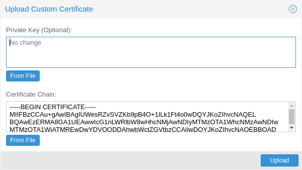
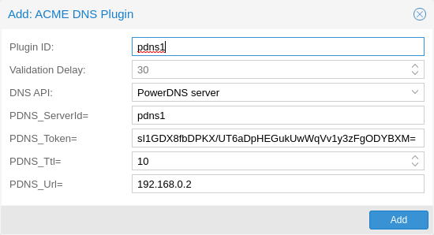
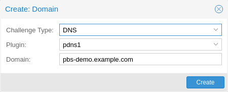

.. _sysadmin_certificate_management:

Certificate Management
----------------------

Access to the API and thus the web-based administration interface is always
encrypted through ``https``. Each `Proxmox Backup`_ host creates by default its
own (self-signed) certificate. This certificate is used for encrypted
communication with the host’s ``proxmox-backup-proxy`` service, for any API
call between a user or backup-client and the web-interface.

Certificate verification when sending backups to a Proxmox Backup Server
is either done based on pinning the certificate fingerprints in the storage/remote
configuration, or by using certificates, signed by a trusted certificate authority.

.. _sysadmin_certs_api_gui:

Certificates for the API and SMTP
~~~~~~~~~~~~~~~~~~~~~~~~~~~~~~~~~

Proxmox Backup stores its certificate and key in:

-  ``/etc/proxmox-backup/proxy.pem``

-  ``/etc/proxmox-backup/proxy.key``

You have the following options for the certificate:

1. Keep using the default self-signed certificate in
   ``/etc/proxmox-backup/proxy.pem``.

2. Use an externally provided certificate (for example, signed by a
   commercial Certificate Authority (CA)).

3. Use an ACME provider like Let’s Encrypt to get a trusted certificate
   with automatic renewal; this is also integrated in the Proxmox Backup
   API and web interface.

Certificates are managed through the Proxmox Backup
web-interface/API or using the ``proxmox-backup-manager`` CLI tool.

.. _sysadmin_certs_upload_custom:

Upload Custom Certificate
~~~~~~~~~~~~~~~~~~~~~~~~~

If you already have a certificate which you want to use for a Proxmox
Mail Gateway host, you can simply upload that certificate over the web
interface.

Note that any certificate key files must not be password protected.

.. _sysadmin_certs_get_trusted_acme_cert:

Trusted certificates via Let’s Encrypt (ACME)
~~~~~~~~~~~~~~~~~~~~~~~~~~~~~~~~~~~~~~~~~~~~~

Proxmox Backup includes an implementation of the **A**\ utomatic
**C**\ ertificate **M**\ anagement **E**\ nvironment (**ACME**)
protocol, allowing Proxmox Backup admins to use an ACME provider
like Let’s Encrypt for easy setup of TLS certificates, which are
accepted and trusted by modern operating systems and web browsers out of
the box.

Currently, the two ACME endpoints implemented are the `Let’s Encrypt
(LE) <https://letsencrypt.org>`_ production and staging environments.
Our ACME client supports validation of ``http-01`` challenges using a
built-in web server and validation of ``dns-01`` challenges using a DNS
plugin supporting all the DNS API endpoints
`acme.sh <https://acme.sh>`_ does.

.. _sysadmin_certs_acme_account:

ACME Account
^^^^^^^^^^^^

.. image:: images/screenshots/pbs-gui-acme-create-account.png
  :target: _images/pbs-gui-acme-create-account.png
  :align: right
  :alt: Create ACME Account

You need to register an ACME account per cluster, with the endpoint you
want to use. The email address used for that account will serve as the
contact point for renewal-due or similar notifications from the ACME
endpoint.

You can register or deactivate ACME accounts over the web interface
``Certificates -> ACME Accounts`` or using the ``proxmox-backup-manager``
command-line tool.

::

    proxmox-backup-manager acme account register <account-name> <mail@example.com>

.. tip::

   Because of
   `rate-limits <https://letsencrypt.org/docs/rate-limits/>`_ you
   should use LE ``staging`` for experiments or if you use ACME for the
   very first time until all is working there, and only then switch over
   to the production directory.

.. _sysadmin_certs_acme_plugins:

ACME Plugins
^^^^^^^^^^^^

The ACME plugin’s role is to provide automatic verification that you,
and thus the Proxmox Backup Server under your operation, are the
real owner of a domain. This is the basic building block of automatic
certificate management.

The ACME protocol specifies different types of challenges, for example
the ``http-01``, where a web server provides a file with a specific
token to prove that it controls a domain. Sometimes this isn’t possible,
either because of technical limitations or if the address of a record is
not reachable from the public internet. The ``dns-01`` challenge can be
used in such cases. This challenge is fulfilled by creating a certain
DNS record in the domain’s zone.

Proxmox Backup supports both of those challenge types out of the
box, you can configure plugins either over the web interface under
``Certificates -> ACME Challenges``, or using the
``proxmox-backup-manager acme plugin add`` command.

ACME Plugin configurations are stored in ``/etc/proxmox-backup/acme/plugins.cfg``.

.. _domains:

Domains
^^^^^^^

You can add new or manage existing domain entries under
``Certificates``, or using the ``proxmox-backup-manager`` command.

After configuring the desired domain(s) for a node and ensuring that the
desired ACME account is selected, you can order your new certificate
over the web-interface. On success, the interface will reload after
roughly 10 seconds.

Renewal will happen `automatically <#sysadmin-certs-acme-automatic-renewal>`_

.. _sysadmin_certs_acme_http_challenge:

ACME HTTP Challenge Plugin
~~~~~~~~~~~~~~~~~~~~~~~~~~

There is always an implicitly configured ``standalone`` plugin for
validating ``http-01`` challenges via the built-in web server spawned on
port 80.

.. note::

   The name ``standalone`` means that it can provide the validation on
   its own, without any third party service.

There are a few prerequisites to use this for certificate management
with Let’s Encrypts ACME.

-  You have to accept the ToS of Let’s Encrypt to register an account.

-  **Port 80** of the node needs to be reachable from the internet.

-  There **must** be no other listener on port 80.

-  The requested (sub)domain needs to resolve to a public IP of the
   Proxmox Backup host.

.. _sysadmin_certs_acme_dns_challenge:

ACME DNS API Challenge Plugin
~~~~~~~~~~~~~~~~~~~~~~~~~~~~~

On systems where external access for validation via the ``http-01``
method is not possible or desired, it is possible to use the ``dns-01``
validation method. This validation method requires a DNS server that
allows provisioning of ``TXT`` records via an API.

.. _sysadmin_certs_acme_dns_api_config:

Configuring ACME DNS APIs for validation
^^^^^^^^^^^^^^^^^^^^^^^^^^^^^^^^^^^^^^^^

Proxmox Backup re-uses the DNS plugins developed for the
``acme.sh``  [1]_ project. Please refer to its documentation for details
on configuration of specific APIs.

The easiest way to configure a new plugin with the DNS API is using the
web interface (``Certificates -> ACME Accounts/Challenges``).

Here you can add a new challenge plugin by selecting your API provider
and entering the credential data to access your account over their API.

.. tip::

   See the acme.sh `How to use DNS
   API <https://github.com/acmesh-official/acme.sh/wiki/dnsapi#how-to-use-dns-api>`_
   wiki for more detailed information about getting API credentials for
   your provider. Configuration values do not need to be quoted with
   single or double quotes; for some plugins that is even an error.

As there are many DNS providers and API endpoints, Proxmox Backup
automatically generates the form for the credentials, but not all
providers are annotated yet. For those you will see a bigger text area,
into which you simply need to copy all the credential’s
``KEY``\ =\ ``VALUE`` pairs.

.. _dns_validation_through_cname_alias:

DNS Validation through CNAME Alias
^^^^^^^^^^^^^^^^^^^^^^^^^^^^^^^^^^

A special ``alias`` mode can be used to handle validation on a different
domain/DNS server, in case your primary/real DNS does not support
provisioning via an API. Manually set up a permanent ``CNAME`` record
for ``_acme-challenge.domain1.example`` pointing to
``_acme-challenge.domain2.example``, and set the ``alias`` property in
the Proxmox Backup node configuration file ``/etc/proxmox-backup/node.cfg``
to ``domain2.example`` to allow the DNS server of ``domain2.example`` to
validate all challenges for ``domain1.example``.

.. _sysadmin_certs_acme_dns_wildcard:

Wildcard Certificates
^^^^^^^^^^^^^^^^^^^^^

Wildcard DNS names start with a ``*.`` prefix and are considered valid
for all (one-level) subdomain names of the verified domain. So a
certificate for ``*.domain.example`` is valid for ``foo.domain.example``
and ``bar.domain.example``, but not for ``baz.foo.domain.example``.

Currently, you can only create wildcard certificates with the `DNS
challenge
type <https://letsencrypt.org/docs/challenge-types/#dns-01-challenge>`_.

.. _combination_of_plugins:

Combination of Plugins
^^^^^^^^^^^^^^^^^^^^^^

Combining ``http-01`` and ``dns-01`` validation is possible in case your
node is reachable via multiple domains with different requirements / DNS
provisioning capabilities. Mixing DNS APIs from multiple providers or
instances is also possible by specifying different plugin instances per
domain.

.. tip::

   Accessing the same service over multiple domains increases complexity
   and should be avoided if possible.

.. _sysadmin_certs_acme_automatic_renewal:

Automatic renewal of ACME certificates
~~~~~~~~~~~~~~~~~~~~~~~~~~~~~~~~~~~~~~

If a node has been successfully configured with an ACME-provided
certificate (either via ``proxmox-backup-manager`` or via the web-interface/API), the
certificate will be renewed automatically by the ``proxmox-backup-daily-update.service``.
Currently, renewal is triggered if the certificate either has already
expired or if it will expire in the next 30 days.

.. _manually_change_certificate_over_command_line:

Manually Change Certificate over the Command Line
~~~~~~~~~~~~~~~~~~~~~~~~~~~~~~~~~~~~~~~~~~~~~~~~~

If you want to get rid of certificate verification warnings, you have to
generate a valid certificate for your server.

Log in to your Proxmox Backup via ssh or use the console:

::

   openssl req -newkey rsa:2048 -nodes -keyout key.pem -out req.pem

Follow the instructions on the screen, for example:

::

   Country Name (2 letter code) [AU]: AT
   State or Province Name (full name) [Some-State]:Vienna
   Locality Name (eg, city) []:Vienna
   Organization Name (eg, company) [Internet Widgits Pty Ltd]: Proxmox GmbH
   Organizational Unit Name (eg, section) []:Proxmox Backup
   Common Name (eg, YOUR name) []: yourproxmox.yourdomain.com
   Email Address []:support@yourdomain.com

   Please enter the following 'extra' attributes to be sent with your certificate request
   A challenge password []: not necessary
   An optional company name []: not necessary

After you have finished the certificate request, you have to send the
file ``req.pem`` to your Certification Authority (CA). The CA will issue
the certificate (BASE64 encoded), based on your request – save this file
as ``cert.pem`` to your Proxmox Backup.

To activate the new certificate, do the following on your Proxmox Backup

::

   cp key.pem /etc/proxmox-backup/proxy.key
   cp cert.pem /etc/proxmox-backup/proxy.pem

Then restart the API servers:

::

   systemctl restart proxmox-backup-proxy

Test your new certificate, using your browser.

.. note::

   To transfer files to and from your Proxmox Backup, you can use
   secure copy: If your desktop runs Linux, you can use the ``scp``
   command-line tool. If your desktop PC runs windows, please use an scp
   client like WinSCP (see https://winscp.net/).

.. [1]
   acme.sh https://github.com/acmesh-official/acme.sh
