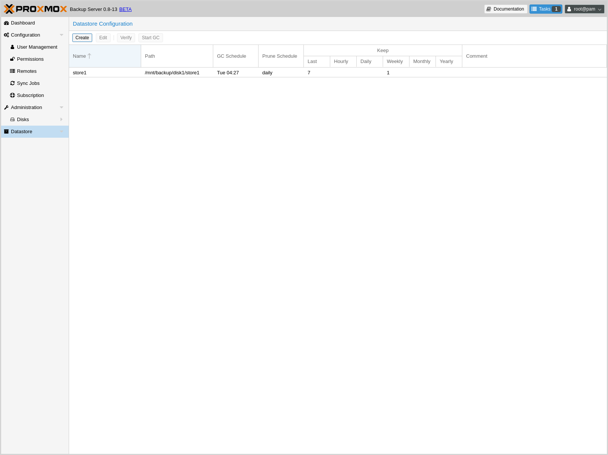

Graphical User Interface
========================

Proxmox Backup Server offers an integrated, web-based interface to manage the
server. This means that you can carry out all administration tasks through your
web browser, and that you don't have to worry about installing extra management
tools. The web interface also provides a built in console, so if you prefer the
command line or need some extra control, you have this option.

The web interface can be accessed via https://youripaddress:8007. The default
login is `root`, and the password is the one specified during the installation
process.

Features
--------

* Simple management interface for Proxmox Backup Server
* Monitoring of tasks, logs and resource usage
* Management of users, permissions, datastores, etc.
* Secure HTML5 console
* Support for multiple authentication sources
* Support for multiple languages
* Based on ExtJS 6.x JavaScript framework

Login
-----

.. image:: images/screenshots/pbs-gui-login-window.png
  :width: 250
  :align: right
  :alt: PBS login window

When you connect to the web interface, you will first see the login window.
Proxmox Backup Server supports various languages and authentication back ends
(*Realms*), both of which can be selected here.

.. note:: For convenience, you can save the username on the client side, by
  selecting the "Save User name" checkbox at the bottom of the window.

GUI Overview
------------

.. image:: images/screenshots/pbs-gui-dashboard.png
  :width: 250
  :align: right
  :alt: PBS GUI Dashboard

The Proxmox Backup Server web interface consists of 3 main sections:

* **Header**: At the top. This shows version information, and contains buttons to view
  documentation, monitor running tasks, and logout.
* **Sidebar**: On the left. This contains the configuration options for
  the server.
* **Configuration Panel**: In the center. This contains the control interface for the
  configuration options in the *Sidebar*.

Sidebar
-------

In the sidebar, on the left side of the page, you can see various items relating
to specific management activities.

Dashboard
^^^^^^^^^

The Dashboard shows a summary of activity and resource usage on the server.
Specifically, this displays hardware usage, a summary of
previous and currently running tasks, and subscription information.

Configuration
^^^^^^^^^^^^^

The Configuration section contains some system configuration options, such as
time and network configuration. It also contains the following subsections:

* **User Management**: Add users and manage accounts
* **Permissions**: Manage permissions for various users
* **Remotes**: Add, edit and remove remotes (see :term:`Remote`)
* **Sync Jobs**: Manage and run sync jobs to remotes
* **Subscription**: Upload a subscription key and view subscription status

Administration
^^^^^^^^^^^^^^

.. image:: images/screenshots/pbs-gui-administration-serverstatus.png
  :width: 250
  :align: right
  :alt: Administration: Server Status overview

The Administration section contains a top panel, with further administration
tasks and information. These are:

* **ServerStatus**: Provides access to the console, power options, and various
  resource usage statistics
* **Services**: Manage and monitor system services
* **Updates**: An interface for upgrading packages
* **Syslog**: View log messages from the server
* **Tasks**: Task history with multiple filter options

.. image:: images/screenshots/pbs-gui-disks.png
  :width: 250
  :align: right
  :alt: Administration: Disks

The administration menu item also contains a disk management subsection:

* **Disks**: View information on available disks

  * **Directory**: Create and view information on *ext4* and *xfs* disks
  * **ZFS**: Create and view information on *ZFS* disks 

Datastore
^^^^^^^^^

The Datastore section provides an interface for creating and managing
datastores. It contains a subsection for each datastore on the system, in
which you can use the top panel to view:

* **Content**: Information on the datastore's backup groups and their respective
  contents
* **Statistics**: Usage statistics for the datastore
* **Permissions**: View and manage permissions for the datastore
