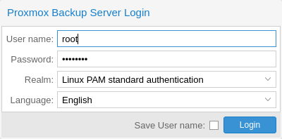
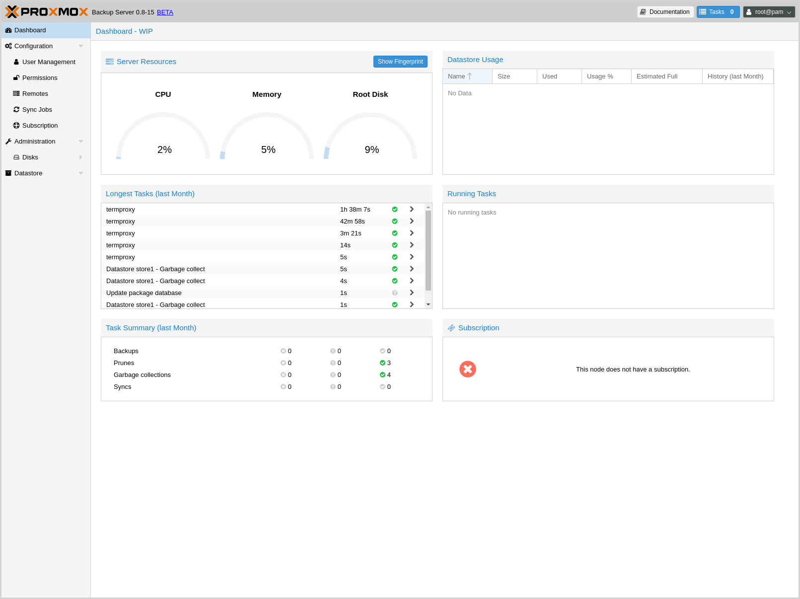
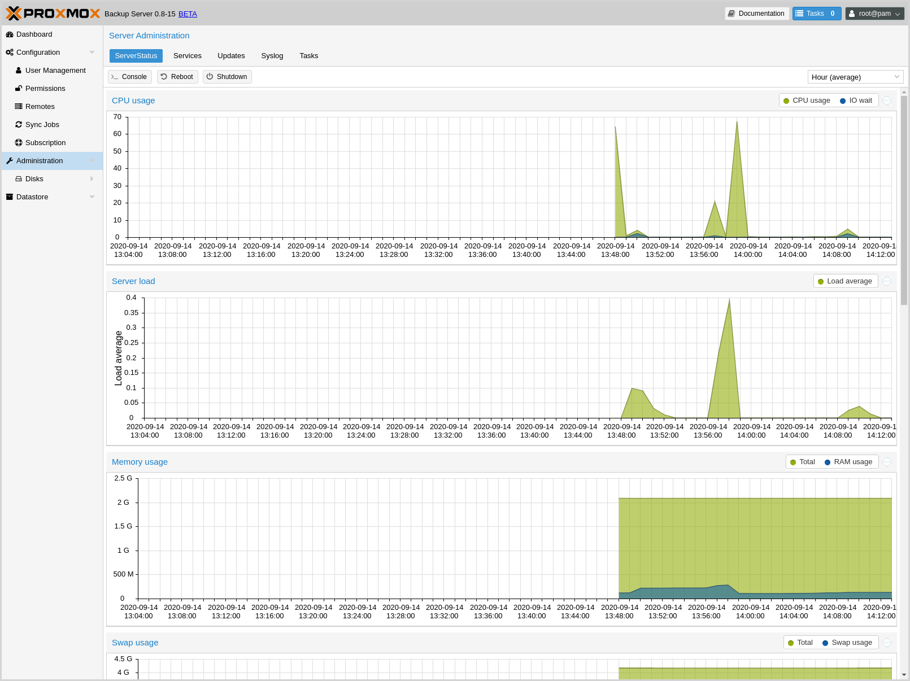
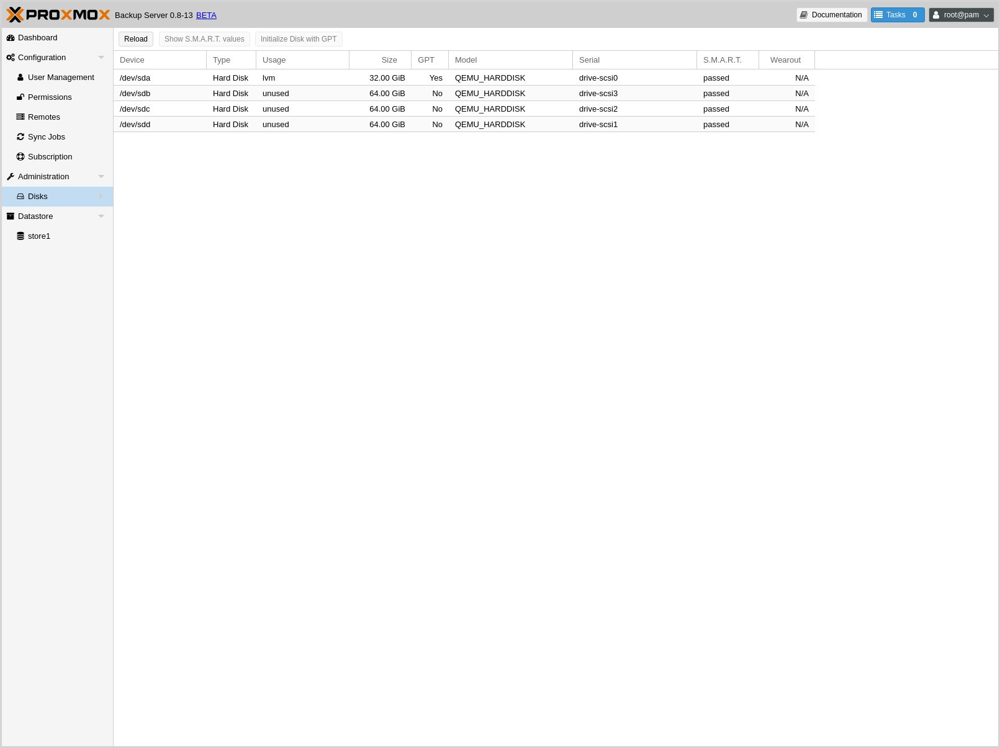
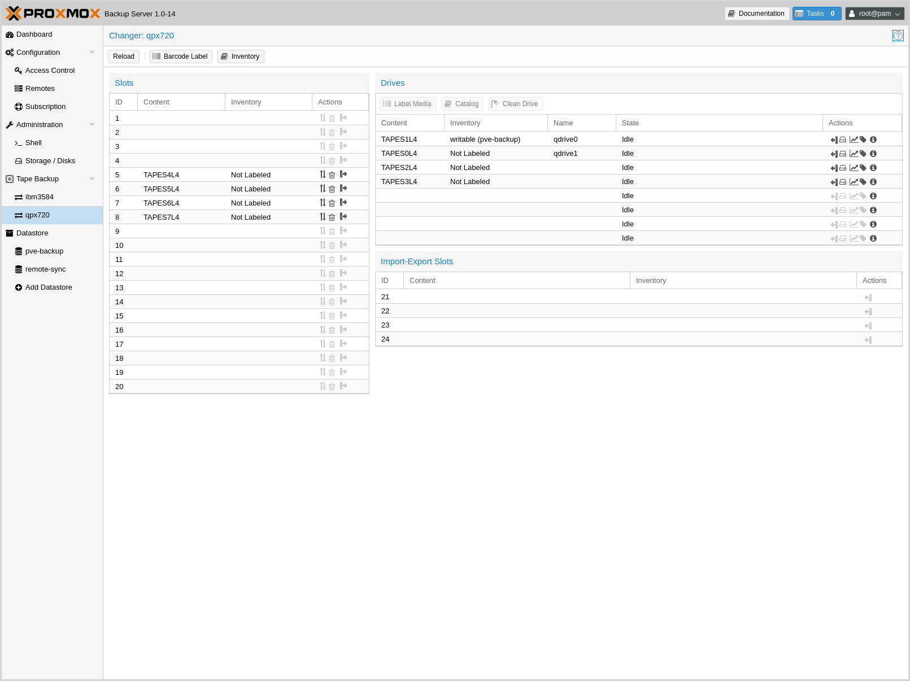
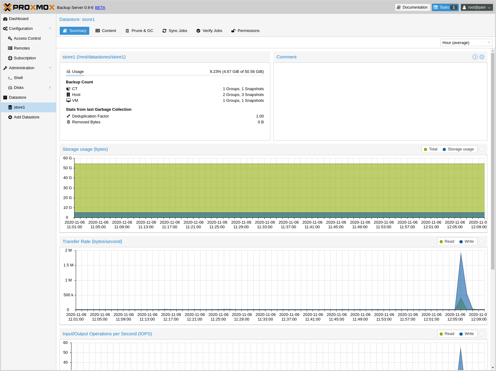

Graphical User Interface
========================

`Proxmox Backup`_ Server offers an integrated, web-based interface to manage the
server. This means that you can carry out all administration tasks through your
web browser, and that you don't have to worry about installing extra management
tools. The web interface also provides a built-in console, so if you prefer the
command line or need some extra control, you have this option.

The web interface can be accessed via https://youripaddress:8007. The default
login is `root`, and the password is either the one specified during the
installation process or the password of the root user, in case of installation
on top of Debian.

Features
--------

* Simple management interface for Proxmox Backup Server
* Monitoring of tasks, logs and resource usage
* Management of users, permissions, datastores, etc.
* Secure HTML5 console
* Support for multiple authentication sources
* Support for multiple languages
* Based on ExtJS 6.x JavaScript framework

Login
-----

When you connect to the web interface, you will first see the login window.
Proxmox Backup Server supports various languages and authentication back ends
(*Realms*), both of which can be selected here.

.. note:: For convenience, you can save the username on the client side, by
  selecting the "Save User name" checkbox at the bottom of the window.

GUI Overview
------------

The Proxmox Backup Server web interface consists of 3 main sections:

* **Header**: At the top. This shows version information and contains buttons to
  view documentation, monitor running tasks, set the language, configure various
  display settings, and logout.
* **Sidebar**: On the left. This contains the administration options for
  the server.
* **Configuration Panel**: In the center. This contains the respective control
  interfaces for the administration options in the *Sidebar*.

Sidebar
-------

In the sidebar, on the left side of the page, you can see various items relating
to specific management activities.

Dashboard
^^^^^^^^^

The Dashboard shows a summary of activity and resource usage on the server.
Specifically, this displays hardware usage, a summary of
previous and currently running tasks, and subscription information.

Configuration
^^^^^^^^^^^^^

The Configuration section contains some system options, such as time, network,
WebAuthn, and HTTP proxy configuration. It also contains the following
subsections:

* **Access Control**: Add and manage users, API tokens, and the permissions
  associated with these items
* **Remotes**: Add, edit and remove remotes (see :term:`Remote`)
* **Certificates**: Manage ACME accounts and create SSL certificates.
* **Subscription**: Upload a subscription key, view subscription status and
  access a text-based system report.

Administration
^^^^^^^^^^^^^^

The Administration section contains a top panel, with further administration
tasks and information. These are:

* **ServerStatus**: Provides access to the console, power options, and various
  resource usage statistics
* **Services**: Manage and monitor system services
* **Updates**: An interface for upgrading packages
* **Repositories**: An interface for configuring APT repositories
* **Syslog**: View log messages from the server
* **Tasks**: Task history with multiple filter options

The administration menu item also contains a disk management subsection:

* **Disks**: View information on available disks

  * **Directory**: Create and view information on *ext4* and *xfs* disks
  * **ZFS**: Create and view information on *ZFS* disks

Tape Backup
^^^^^^^^^^^

The `Tape Backup`_ section contains a top panel, with options for managing tape
media sets, inventories, drives, changers, encryption keys, and the tape backup
jobs itself. The tabs are as follows:

* **Content**: Information on the contents of the tape backup
* **Inventory**: Manage the tapes attached to the system
* **Changers**: Manage tape loading devices
* **Drives**: Manage drives used for reading and writing to tapes
* **Media Pools**: Manage logical pools of tapes
* **Encryption Keys**: Manage tape backup encryption keys
* **Backup Jobs**: Manage tape backup jobs

The section also contains a subsection per standalone drive and per changer,
with a status and management view for those devices.

Datastore
^^^^^^^^^

The Datastore section contains interfaces for creating and managing
datastores. It also contains a button for creating a new datastore on the
server, as well as a subsection for each datastore on the system, in which you
can use the top panel to view:

* **Summary**: Access a range of datastore usage statistics
* **Content**: Information on the datastore's backup groups and their respective
  contents
* **Prune & GC**: Schedule :ref:`pruning <backup-pruning>` and :ref:`garbage
  collection <client_garbage-collection>` operations, and run garbage collection
  manually
* **Sync Jobs**: Create, manage and run :ref:`syncjobs` from remote servers
* **Verify Jobs**: Create, manage and run :ref:`maintenance_verification` jobs
  on the datastore
* **Options**: Configure notification and verification settings
* **Permissions**: Manage permissions on the datastore
