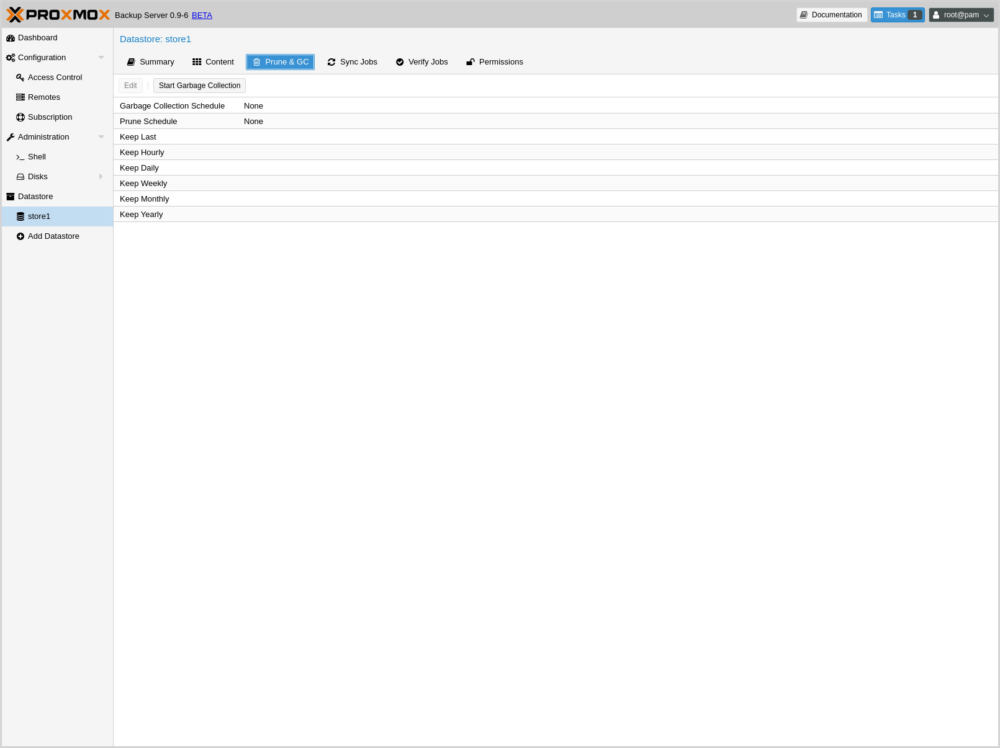
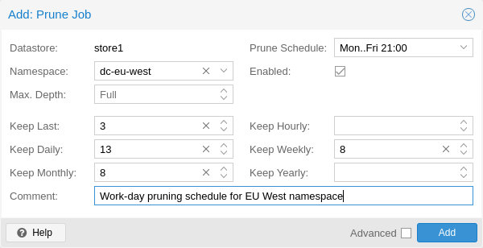
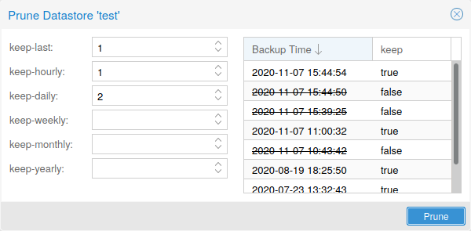
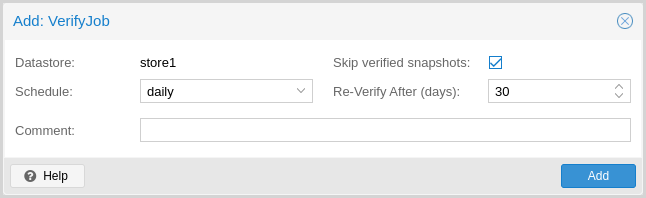

Maintenance Tasks
=================

.. _maintenance_pruning:

Pruning
-------

Prune lets you specify which backup snapshots you want to keep.
The following retention options are available:

``keep-last <N>``
  Keep the last ``<N>`` backup snapshots.

``keep-hourly <N>``
  Keep backups for the last ``<N>`` hours. If there is more than one
  backup for a single hour, only the latest is retained.

``keep-daily <N>``
  Keep backups for the last ``<N>`` days. If there is more than one
  backup for a single day, only the latest is retained.

``keep-weekly <N>``
  Keep backups for the last ``<N>`` weeks. If there is more than one
  backup for a single week, only the latest is retained.

  .. note:: Weeks start on Monday and end on Sunday. The software
     uses the `ISO week date`_ system and handles weeks at
     the end of the year correctly.

``keep-monthly <N>``
  Keep backups for the last ``<N>`` months. If there is more than one
  backup for a single month, only the latest is retained.

``keep-yearly <N>``
  Keep backups for the last ``<N>`` years. If there is more than one
  backup for a single year, only the latest is retained.

The retention options are processed in the order given above. Each option
only covers backups within its time period. The next option does not take care
of already covered backups. It will only consider older backups.

Old unfinished or incomplete backups will be removed by the prune command,
unless they are newer than the last successful backup. In this case, the last
failed backup is retained.

Prune Simulator
^^^^^^^^^^^^^^^

You can use the built-in `prune simulator <prune-simulator/index.html>`_
to explore the effect of different retention options with various backup
schedules.

.. _maintenance_prune_jobs:

Prune Jobs
^^^^^^^^^^

Prune jobs are configured to periodically prune a datastore or a subset of it.
You can manage prune jobs in the web interface, from the **Prune & GC** tab of
the **Datastore** panel or from that of the Datastore itself. Alternatively,
you can manage them with the ``proxmox-backup-manager prune-job`` command. The
configuration information for prune jobs is stored at
``/etc/proxmox-backup/prune.cfg``. To create a new prune job, click the add
button in the GUI, or use the manager CLI's ``create`` subcommand. After
creating a prune job, you can either start it manually from the GUI or provide
it with a schedule (see :ref:`calendar-event-scheduling`) to run regularly.

Each prune job has settings for retention, limitation of scope and frequency.

``store <datastore>``
 The datastore you want to run this prune job on.

``ns <namespace>``
 Limit the prune job to a specific namespace.

``max-depth <N>``
 Configure the namespace depth it should prune from below the configured
 namespace. For example, `0` to only prune the backup groups available directly
 on the configured namespace itself. Omit the parameter to scan to the full
 depth below.

``schedule``
 Configure a :ref:`calendar event interval <calendar-event-scheduling>` for
 when to automatically trigger this job. You can omit this if you want to
 trigger a job only manually.

``keep-X``
 See the description of the various retention options above.

``disable``
 Set to disable a job temporarily while keeping its settings.

``comment``
 You can add a short comment for a job, for example about it intentions.

Manual Pruning
^^^^^^^^^^^^^^

To manually prune a specific backup group, you can use
``proxmox-backup-client``'s ``prune`` subcommand, discussed in
:ref:`backup-pruning`, or navigate to the **Content** tab of the datastore and
click the scissors icon in the **Actions** column of the relevant backup group.

Retention Settings Example
^^^^^^^^^^^^^^^^^^^^^^^^^^

The backup frequency and retention of old backups may depend on how often data
changes and how important an older state may be in a specific workload.
When backups act as a company's document archive, there may also be legal
requirements for how long backup snapshots must be kept.

For this example, we assume that you are doing daily backups, have a retention
period of 10 years, and the period between backups stored gradually grows.

- **keep-last:** ``3`` - even if only daily backups, an admin may want to create
  an extra one just before or after a big upgrade. Setting keep-last ensures
  this.

- **keep-hourly:** not set - for daily backups this is not relevant. You cover
  extra manual backups already, with keep-last.

- **keep-daily:** ``13`` - together with keep-last, which covers at least one
  day, this ensures that you have at least two weeks of backups.

- **keep-weekly:** ``8`` - ensures that you have at least two full months of
  weekly backups.

- **keep-monthly:** ``11`` - together with the previous keep settings, this
  ensures that you have at least a year of monthly backups.

- **keep-yearly:** ``9`` - this is for the long term archive. As you covered the
  current year with the previous options, you would set this to nine for the
  remaining ones, giving you a total of at least 10 years of coverage.

We recommend that you use a higher retention period than is minimally required
by your environment; you can always reduce it if you find it is unnecessarily
high, but you cannot recreate backup snapshots from the past.

.. _maintenance_gc:

Garbage Collection
------------------

Garbage collection (GC) is the process that frees up space in a datastore by
deleting all unused backup chunks from chunk storage. GC completes the pruning
of backup snapshots, which deletes only the metadata, not the underlying backup
data.

It's recommended to setup a schedule to ensure that unused space is cleaned up
periodically. For most setups a weekly schedule provides a good interval to
start.

GC Background
^^^^^^^^^^^^^

In `Proxmox Backup`_ Server, backup data is not saved directly, but rather as
chunks that are referred to by the indexes of each backup snapshot. This
approach enables reuse of chunks through deduplication, among other benefits
that are detailed in the :ref:`tech_design_overview`.

When deleting a backup snapshot, Proxmox Backup Server cannot directly remove
the chunks associated with it because other backups, even ones that are still
running, may have references to those chunks. To avoid excessive load and slow
performance, the whole datastore cannot be locked to scan all other indexes for
references to the same chunks on every snapshot deletion. Moreover, locking the
entire datastore is not feasible because new backups would be blocked until the deletion
process was complete.

Therefore, Proxmox Backup Server uses a garbage collection (GC) process to
identify and remove the unused backup chunks that are no longer needed by any
snapshot in the datastore. The GC process is designed to efficiently reclaim
the space occupied by these chunks with low impact on the performance of the
datastore or interfering with other backups.

The garbage collection (GC) process is performed per datastore and is split
into two phases:

- Phase one: Mark
  All index files are read, and the access time of the referred chunk files is
  updated.

- Phase two: Sweep
  The task iterates over all chunks, checks their file access time, and if it
  is older than the cutoff time (i.e., the time when GC started, plus some
  headroom for safety and Linux file system behavior), the task knows that the
  chunk was neither referred to in any backup index nor part of any currently
  running backup that has no index to scan for. As such, the chunk can be
  safely deleted.

Manually Starting GC
^^^^^^^^^^^^^^^^^^^^

You can monitor and run :ref:`garbage collection <client_garbage-collection>` on the
Proxmox Backup Server using the ``garbage-collection`` subcommand of
``proxmox-backup-manager``. You can use the ``start`` subcommand to manually
start garbage collection on an entire datastore and the ``status`` subcommand to
see attributes relating to the :ref:`garbage collection <client_garbage-collection>`.

This functionality can also be accessed in the web UI using the `Start Garbage
Collection` button found in each datastore's **Prune & GC** tab.

Scheduled GC
^^^^^^^^^^^^

Normally, datastore admins don't want to bother triggering GC's manually.
That's why you can configure a schedule to let Proxmox Backup Server handle it.

Setting or editing a datastore's GC schedule can be either done by using the
``proxmox-backup-manager datastore update <datastore> --gc-schedule <schedule>``
CLI command or the edit window in the web UI in each datastore's **Prune & GC**
tab.

The GC scheduling uses the :ref:`calendar-event-scheduling` format.

.. tip:: You can disable automatic GC runs by clearing the schedule by either
   clearing the content of the field in the web UI or using the
   ``proxmox-backup-manager datastore update <datastore> --delete gc-schedule``
   CLI command. This might be, for example, useful during maintenance or if you
   archive a datastore for good.

.. _maintenance_verification:

Verification
------------

Proxmox Backup Server offers various verification options to ensure that backup
data is intact. Verification is generally carried out through the creation of
verify jobs. These are scheduled tasks that run verification at a given interval
(see :ref:`calendar-event-scheduling`). With these, you can also set whether
already verified snapshots are ignored, as well as set a time period, after
which snapshots are checked again. The interface for creating verify jobs can be
found under the **Verify Jobs** tab of the datastore.

.. Note:: It is recommended that you reverify all backups at least monthly, even
  if a previous verification was successful. This is because physical drives
  are susceptible to damage over time, which can cause an old, working backup
  to become corrupted in a process known as `bit rot/data degradation
  <https://en.wikipedia.org/wiki/Data_degradation>`_. It is good practice to
  have a regularly recurring (hourly/daily) verification job, which checks new
  and expired backups, then another weekly/monthly job that will reverify
  everything. This way, there will be no surprises when it comes to restoring
  data.

Aside from using verify jobs, you can also run verification manually on entire
datastores, backup groups or snapshots. To do this, navigate to the **Content**
tab of the datastore and either click *Verify All* or select the *V.* icon from
the **Actions** column in the table.

.. _maintenance_notification:

Notifications
-------------

Proxmox Backup Server can send you notification emails about automatically
scheduled verification, garbage-collection and synchronization tasks results.

By default, notifications are sent to the email address configured for the
`root@pam` user. You can instead set this user for each datastore.

.. image:: images/screenshots/pbs-gui-datastore-options.png
  :target: _images/pbs-gui-datastore-options.png
  :align: right
  :alt: Datastore Options

You can also change the level of notification received per task type, the
following options are available:

* Always: send a notification for any scheduled task, independent of the
  outcome

* Errors: send a notification for any scheduled task that results in an error

* Never: do not send any notification at all

.. _maintenance_mode:

Maintenance Mode
----------------

Proxmox Backup Server supports setting `read-only` and `offline`
maintenance modes on a datastore.

Once enabled, depending on the mode, new reads and/or writes to the datastore
are blocked, allowing an administrator to safely execute maintenance tasks, for
example, on the underlying storage.

Internally Proxmox Backup Server tracks whether each datastore access is a
write or read operation, so that it can gracefully enter the respective mode,
by allowing conflicting operations that started before enabling the maintenance
mode to finish.
