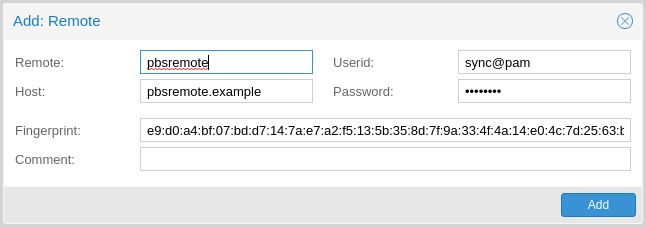
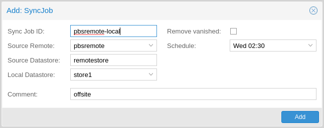

Managing Remotes
================

.. _backup_remote:

:term:`Remote`
--------------

A remote refers to a separate Proxmox Backup Server installation and a user on that
installation, from which you can `sync` datastores to a local datastore with a
`Sync Job`. You can configure remotes in the web interface, under **Configuration
-> Remotes**. Alternatively, you can use the ``remote`` subcommand. The
configuration information for remotes is stored in the file
``/etc/proxmox-backup/remote.cfg``.

To add a remote, you need its hostname or IP address, a userid and password on
the remote, and its certificate fingerprint. To get the fingerprint, use the
``proxmox-backup-manager cert info`` command on the remote, or navigate to
**Dashboard** in the remote's web interface and select **Show Fingerprint**.

.. code-block:: console

  # proxmox-backup-manager cert info |grep Fingerprint
  Fingerprint (sha256): 64:d3:ff:3a:50:38:53:5a:9b:f7:50:...:ab:fe

Using the information specified above, you can add a remote from the **Remotes**
configuration panel, or by using the command:

.. code-block:: console

  # proxmox-backup-manager remote create pbs2 --host pbs2.mydomain.example --userid sync@pam --password 'SECRET' --fingerprint 64:d3:ff:3a:50:38:53:5a:9b:f7:50:...:ab:fe

Use the ``list``, ``show``, ``update``, ``remove`` subcommands of
``proxmox-backup-manager remote`` to manage your remotes:

.. code-block:: console

  # proxmox-backup-manager remote update pbs2 --host pbs2.example
  # proxmox-backup-manager remote list
  ┌──────┬──────────────┬──────────┬───────────────────────────────────────────┬─────────┐
  │ name │ host         │ userid   │ fingerprint                               │ comment │
  ╞══════╪══════════════╪══════════╪═══════════════════════════════════════════╪═════════╡
  │ pbs2 │ pbs2.example │ sync@pam │64:d3:ff:3a:50:38:53:5a:9b:f7:50:...:ab:fe │         │
  └──────┴──────────────┴──────────┴───────────────────────────────────────────┴─────────┘
  # proxmox-backup-manager remote remove pbs2

.. _syncjobs:

Sync Jobs
---------

Sync jobs are configured to pull the contents of a datastore on a **Remote** to
a local datastore. You can manage sync jobs in the web interface, from the
**Sync Jobs** tab of the **Datastore** panel or from that of the Datastore
itself. Alternatively, you can manage them with the ``proxmox-backup-manager
sync-job`` command. The configuration information for sync jobs is stored at
``/etc/proxmox-backup/sync.cfg``. To create a new sync job, click the add button
in the GUI, or use the ``create`` subcommand. After creating a sync job, you can
either start it manually from the GUI or provide it with a schedule (see
:ref:`calendar-event-scheduling`) to run regularly.

.. code-block:: console

  # proxmox-backup-manager sync-job create pbs2-local --remote pbs2 --remote-store local --store local --schedule 'Wed 02:30'
  # proxmox-backup-manager sync-job update pbs2-local --comment 'offsite'
  # proxmox-backup-manager sync-job list
  ┌────────────┬───────┬────────┬──────────────┬───────────┬─────────┐
  │ id         │ store │ remote │ remote-store │ schedule  │ comment │
  ╞════════════╪═══════╪════════╪══════════════╪═══════════╪═════════╡
  │ pbs2-local │ local │ pbs2   │ local        │ Wed 02:30 │ offsite │
  └────────────┴───────┴────────┴──────────────┴───────────┴─────────┘
  # proxmox-backup-manager sync-job remove pbs2-local

To set up sync jobs, the configuring user needs the following permissions:

#. ``Remote.Read`` on the ``/remote/{remote}/{remote-store}`` path
#. At least ``Datastore.Backup`` on the local target datastore (``/datastore/{store}``)

.. note:: A sync job can only sync backup groups that the configured remote's
  user/API token can read. If a remote is configured with a user/API token that
  only has ``Datastore.Backup`` privileges, only the limited set of accessible
  snapshots owned by that user/API token can be synced.

If the ``remove-vanished`` option is set, ``Datastore.Prune`` is required on
the local datastore as well. If the ``owner`` option is not set (defaulting to
``root@pam``) or is set to something other than the configuring user,
``Datastore.Modify`` is required as well.

If the ``group-filter`` option is set, only backup groups matching at least one
of the specified criteria are synced. The available criteria are:

* backup type, for example to only sync groups of the `ct` (Container) type:
    .. code-block:: console

     # proxmox-backup-manager sync-job update ID --group-filter type:ct
* full group identifier
    .. code-block:: console

     # proxmox-backup-manager sync-job update ID --group-filter group:vm/100
* regular expression matched against the full group identifier
.. todo:: add example for regex

The same filter is applied to local groups for handling of the
``remove-vanished`` option.

Bandwidth Limit
^^^^^^^^^^^^^^^

Syncing datastores to an archive can produce lots of traffic and impact other
users of the network. So, to avoid network or storage congetsion you can limit
the bandwith of the sync job by setting the ``rate-in`` option either in the
web interface or using the ``proxmox-backup-manager`` command-line tool:

.. code-block:: console

    # proxmox-backup-manager sync-job update ID --rate-in 20MiB
