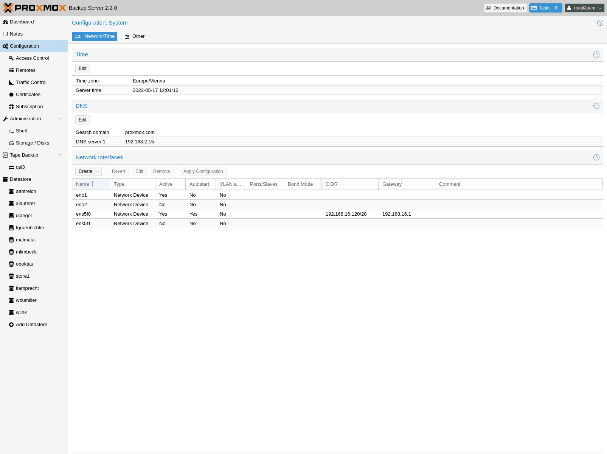
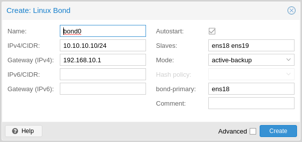

.. _sysadmin_network_configuration:

Network Management
==================

`Proxmox Backup`_ Server provides both a web interface and a command-line tool
for network configuration. You can find the configuration options in the web
interface under the **Network Interfaces** section of the **Configuration** menu
tree item. The command-line tool is accessed via the ``network`` subcommand.
These interfaces allow you to carry out some basic network management tasks,
such as adding, configuring, and removing network interfaces.

.. note:: Any changes made to the network configuration are not
  applied, until you click on **Apply Configuration** or enter the ``network
  reload`` command. This allows you to make many changes at once. It also allows
  you to ensure that your changes are correct before applying them, as making a
  mistake here can render the server inaccessible over the network.

To get a list of available interfaces, use the following command:

.. code-block:: console

  # proxmox-backup-manager network list
  ┌───────┬────────┬───────────┬────────┬─────────────┬──────────────┬──────────────┐
  │ name  │ type   │ autostart │ method │ address     │ gateway      │ ports/slaves │
  ╞═══════╪════════╪═══════════╪════════╪═════════════╪══════════════╪══════════════╡
  │ bond0 │ bond   │         1 │ static │ x.x.x.x/x   │ x.x.x.x      │ ens18 ens19  │
  ├───────┼────────┼───────────┼────────┼─────────────┼──────────────┼──────────────┤
  │ ens18 │ eth    │         1 │ manual │             │              │              │
  ├───────┼────────┼───────────┼────────┼─────────────┼──────────────┼──────────────┤
  │ ens19 │ eth    │         1 │ manual │             │              │              │
  └───────┴────────┴───────────┴────────┴─────────────┴──────────────┴──────────────┘

To add a new network interface, use the ``create`` subcommand with the relevant
parameters. For example, you may want to set up a bond, for the purpose of
network redundancy. The following command shows a template for creating the bond shown
in the list above:

.. code-block:: console

  # proxmox-backup-manager network create bond0 --type bond --bond_mode active-backup --slaves ens18,ens19 --autostart true --cidr x.x.x.x/x --gateway x.x.x.x

You can make changes to the configuration of a network interface with the
``update`` subcommand:

.. code-block:: console

  # proxmox-backup-manager network update bond0 --cidr y.y.y.y/y

You can also remove a network interface:

.. code-block:: console

   # proxmox-backup-manager network remove bond0

The pending changes for the network configuration file will appear at the bottom of the
web interface. You can also view these changes, by using the command:

.. code-block:: console

  # proxmox-backup-manager network changes

If you would like to cancel all changes at this point, you can either click on
the **Revert** button or use the following command:

.. code-block:: console

  # proxmox-backup-manager network revert

If you are happy with the changes and would like to write them into the
configuration file, select **Apply Configuration**. The corresponding command
is:

.. code-block:: console

  # proxmox-backup-manager network reload

.. note:: This command and corresponding GUI button rely on the ``ifreload``
  command, from the package ``ifupdown2``. This package is included within the
  Proxmox Backup Server installation, however, you may have to install it yourself,
  if you have installed Proxmox Backup Server on top of Debian or a Proxmox VE
  version prior to version 7.

You can also configure DNS settings, from the **DNS** section
of **Configuration** or by using the ``dns`` subcommand of
``proxmox-backup-manager``.

.. include:: traffic-control.rst
