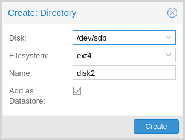
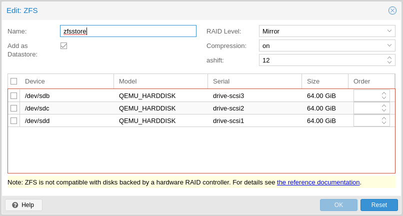
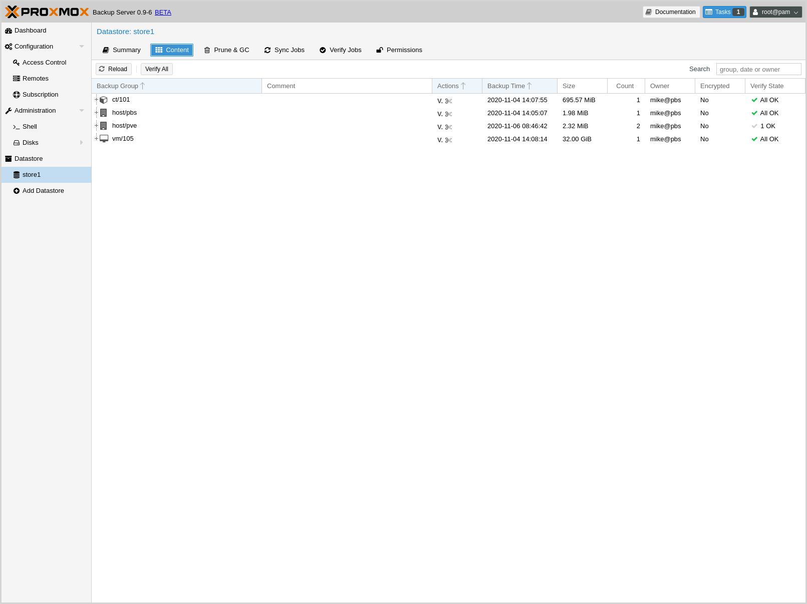
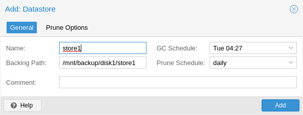
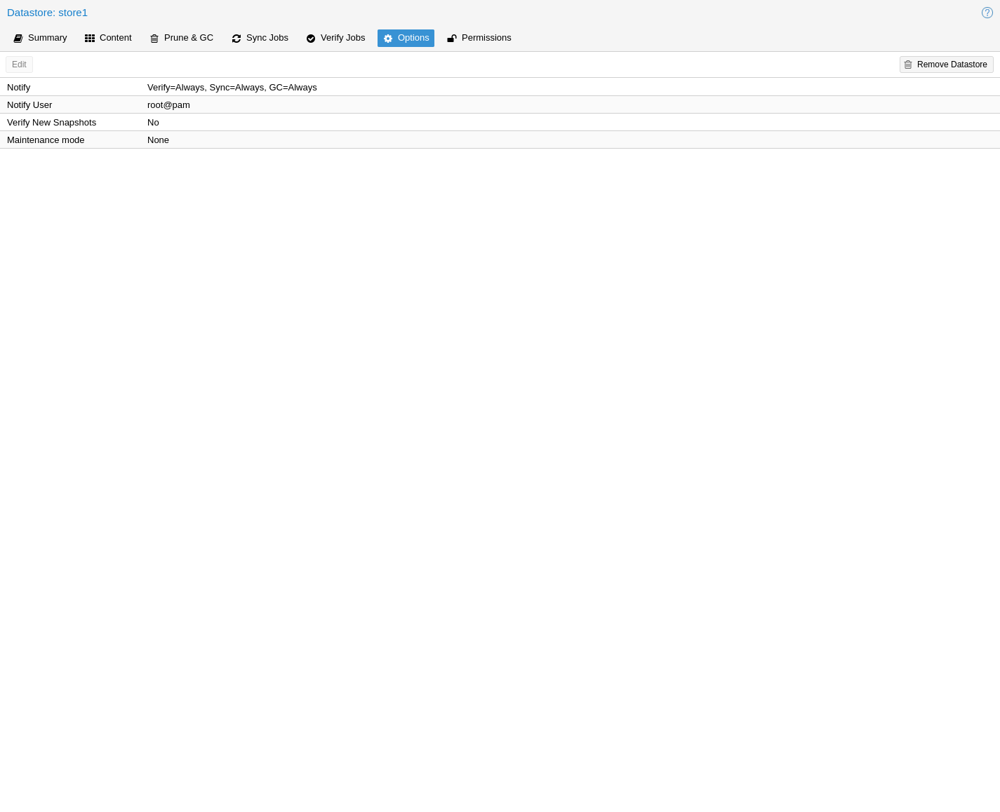

Backup Storage
==============

.. _storage_disk_management:

Disk Management
---------------

.. image:: images/screenshots/pbs-gui-disks.png
  :target: _images/pbs-gui-disks.png
  :align: right
  :alt: List of disks

`Proxmox Backup`_ Server comes with a set of disk utilities, which are
accessed using the ``disk`` subcommand or the web interface. This subcommand
allows you to initialize disks, create various filesystems, and get information
about the disks.

To view the disks connected to the system, navigate to **Administration ->
Storage/Disks** in the web interface or use the ``list`` subcommand of
``disk``:

.. code-block:: console

  # proxmox-backup-manager disk list
  ┌──────┬────────┬─────┬───────────┬─────────────┬───────────────┬─────────┬────────┐
  │ name │ used   │ gpt │ disk-type │        size │ model         │ wearout │ status │
  ╞══════╪════════╪═════╪═══════════╪═════════════╪═══════════════╪═════════╪════════╡
  │ sda  │ lvm    │   1 │ hdd       │ 34359738368 │ QEMU_HARDDISK │       - │ passed │
  ├──────┼────────┼─────┼───────────┼─────────────┼───────────────┼─────────┼────────┤
  │ sdb  │ unused │   1 │ hdd       │ 68719476736 │ QEMU_HARDDISK │       - │ passed │
  ├──────┼────────┼─────┼───────────┼─────────────┼───────────────┼─────────┼────────┤
  │ sdc  │ unused │   1 │ hdd       │ 68719476736 │ QEMU_HARDDISK │       - │ passed │
  └──────┴────────┴─────┴───────────┴─────────────┴───────────────┴─────────┴────────┘

To initialize a disk with a new GPT, use the ``initialize`` subcommand:

.. code-block:: console

  # proxmox-backup-manager disk initialize sdX

You can create an ``ext4`` or ``xfs`` filesystem on a disk using ``fs
create``, or by navigating to **Administration -> Storage/Disks -> Directory**
in the web interface and creating one from there. The following command creates
an ``ext4`` filesystem and passes the ``--add-datastore`` parameter, in order to
automatically create a datastore on the disk. This will
create a datastore at the location ``/mnt/datastore/store1``:

.. code-block:: console

  # proxmox-backup-manager disk fs create store1 --disk sdX --filesystem ext4 --add-datastore true

You can also create a ``zpool`` with various raid levels from **Administration
-> Storage/Disks -> ZFS** in the web interface, or by using ``zpool create``. The command
below creates a mirrored ``zpool`` using two disks and
mounts it under ``/mnt/datastore/zpool1``:

.. code-block:: console

  # proxmox-backup-manager disk zpool create zpool1 --devices sdX,sdY --raidlevel mirror

.. note:: You can also pass the ``--add-datastore`` parameter here, to automatically
  create a datastore from the disk.

You can use ``disk fs list`` and ``disk zpool list`` to keep track of your
filesystems and zpools respectively.

Proxmox Backup Server uses the package smartmontools. This is a set of tools
used to monitor and control the S.M.A.R.T. system for local hard disks. If a
disk supports S.M.A.R.T. capability, and you have this enabled, you can
display S.M.A.R.T. attributes from the web interface or by using the command:

.. code-block:: console

  # proxmox-backup-manager disk smart-attributes sdX

.. note:: This functionality may also be accessed directly through the use of
  the ``smartctl`` command, which comes as part of the smartmontools package
  (see ``man smartctl`` for more details).

.. _datastore_intro:

:term:`Datastore`
-----------------

.. image:: images/screenshots/pbs-gui-datastore-summary.png
  :target: _images/pbs-gui-datastore-summary.png
  :align: right
  :alt: Datastore Usage Overview

A datastore refers to a location at which backups are stored. The current
implementation uses a directory inside a standard Unix file system (``ext4``,
``xfs`` or ``zfs``) to store the backup data.

Datastores are identified by a simple *ID*. You can configure this
when setting up the datastore. The configuration information for datastores
is stored in the file ``/etc/proxmox-backup/datastore.cfg``.

.. note:: The `File Layout`_ requires the file system to support at least *65538*
   subdirectories per directory. That number comes from the 2\ :sup:`16`
   pre-created chunk namespace directories, and the ``.`` and ``..`` default
   directory entries. This requirement excludes certain filesystems and
   filesystem configurations from being supported for a datastore. For example,
   ``ext3`` as a whole or ``ext4`` with the ``dir_nlink`` feature manually disabled.

Datastore Configuration
~~~~~~~~~~~~~~~~~~~~~~~

You can configure multiple datastores. A minimum of one datastore needs to be
configured. The datastore is identified by a simple *name* and points to a
directory on the filesystem. Each datastore also has associated retention
settings of how many backup snapshots for each interval of ``hourly``,
``daily``, ``weekly``, ``monthly``, ``yearly`` as well as a time-independent
number of backups to keep in that store. :ref:`backup-pruning` and
:ref:`garbage collection <client_garbage-collection>` can also be configured to
run periodically, based on a configured schedule (see
:ref:`calendar-event-scheduling`) per datastore.

.. _storage_datastore_create:

Creating a Datastore
^^^^^^^^^^^^^^^^^^^^

You can create a new datastore from the web interface, by clicking **Add
Datastore** in the side menu, under the **Datastore** section. In the setup
window:

* *Name* refers to the name of the datastore
* *Backing Path* is the path to the directory upon which you want to create the
  datastore
* *GC Schedule* refers to the time and intervals at which garbage collection
  runs
* *Prune Schedule* refers to the frequency at which pruning takes place
* *Prune Options* set the amount of backups which you would like to keep (see
  :ref:`backup-pruning`).
* *Comment* can be used to add some contextual information to the datastore.

Alternatively you can create a new datastore from the command line. The
following command creates a new datastore called ``store1`` on
:file:`/backup/disk1/store1`

.. code-block:: console

  # proxmox-backup-manager datastore create store1 /backup/disk1/store1

Managing Datastores
^^^^^^^^^^^^^^^^^^^

To list existing datastores from the command line, run:

.. code-block:: console

  # proxmox-backup-manager datastore list
  ┌────────┬──────────────────────┬─────────────────────────────┐
  │ name   │ path                 │ comment                     │
  ╞════════╪══════════════════════╪═════════════════════════════╡
  │ store1 │ /backup/disk1/store1 │ This is my default storage. │
  └────────┴──────────────────────┴─────────────────────────────┘

You can change the garbage collection and prune settings of a datastore, by
editing the datastore from the GUI or by using the ``update`` subcommand. For
example, the below command changes the garbage collection schedule using the
``update`` subcommand and prints the properties of the datastore with the
``show`` subcommand:

.. code-block:: console

  # proxmox-backup-manager datastore update store1 --gc-schedule 'Tue 04:27'
  # proxmox-backup-manager datastore show store1
  ┌────────────────┬─────────────────────────────┐
  │ Name           │ Value                       │
  ╞════════════════╪═════════════════════════════╡
  │ name           │ store1                      │
  ├────────────────┼─────────────────────────────┤
  │ path           │ /backup/disk1/store1        │
  ├────────────────┼─────────────────────────────┤
  │ comment        │ This is my default storage. │
  ├────────────────┼─────────────────────────────┤
  │ gc-schedule    │ Tue 04:27                   │
  ├────────────────┼─────────────────────────────┤
  │ keep-last      │ 7                           │
  ├────────────────┼─────────────────────────────┤
  │ prune-schedule │ daily                       │
  └────────────────┴─────────────────────────────┘

Finally, it is possible to remove the datastore configuration:

.. code-block:: console

  # proxmox-backup-manager datastore remove store1

.. note:: The above command removes only the datastore configuration. It does
   not delete any data from the underlying directory.

File Layout
^^^^^^^^^^^

After creating a datastore, the following default layout will appear:

.. code-block:: console

  # ls -arilh /backup/disk1/store1
  276493 -rw-r--r-- 1 backup backup       0 Jul  8 12:35 .lock
  276490 drwxr-x--- 1 backup backup 1064960 Jul  8 12:35 .chunks

`.lock` is an empty file used for process locking.

The `.chunks` directory contains folders, starting from `0000` and increasing in
hexadecimal values until `ffff`. These directories will store the chunked data,
categorized by checksum, after a backup operation has been executed.

.. code-block:: console

 # ls -arilh /backup/disk1/store1/.chunks
 545824 drwxr-x--- 2 backup backup 4.0K Jul  8 12:35 ffff
 545823 drwxr-x--- 2 backup backup 4.0K Jul  8 12:35 fffe
 415621 drwxr-x--- 2 backup backup 4.0K Jul  8 12:35 fffd
 415620 drwxr-x--- 2 backup backup 4.0K Jul  8 12:35 fffc
 353187 drwxr-x--- 2 backup backup 4.0K Jul  8 12:35 fffb
 344995 drwxr-x--- 2 backup backup 4.0K Jul  8 12:35 fffa
 144079 drwxr-x--- 2 backup backup 4.0K Jul  8 12:35 fff9
 144078 drwxr-x--- 2 backup backup 4.0K Jul  8 12:35 fff8
 144077 drwxr-x--- 2 backup backup 4.0K Jul  8 12:35 fff7
 ...
 403180 drwxr-x--- 2 backup backup 4.0K Jul  8 12:35 000c
 403179 drwxr-x--- 2 backup backup 4.0K Jul  8 12:35 000b
 403177 drwxr-x--- 2 backup backup 4.0K Jul  8 12:35 000a
 402530 drwxr-x--- 2 backup backup 4.0K Jul  8 12:35 0009
 402513 drwxr-x--- 2 backup backup 4.0K Jul  8 12:35 0008
 402509 drwxr-x--- 2 backup backup 4.0K Jul  8 12:35 0007
 276509 drwxr-x--- 2 backup backup 4.0K Jul  8 12:35 0006
 276508 drwxr-x--- 2 backup backup 4.0K Jul  8 12:35 0005
 276507 drwxr-x--- 2 backup backup 4.0K Jul  8 12:35 0004
 276501 drwxr-x--- 2 backup backup 4.0K Jul  8 12:35 0003
 276499 drwxr-x--- 2 backup backup 4.0K Jul  8 12:35 0002
 276498 drwxr-x--- 2 backup backup 4.0K Jul  8 12:35 0001
 276494 drwxr-x--- 2 backup backup 4.0K Jul  8 12:35 0000
 276489 drwxr-xr-x 3 backup backup 4.0K Jul  8 12:35 ..
 276490 drwxr-x--- 1 backup backup 1.1M Jul  8 12:35 .

Once you've uploaded some backups or created namespaces, you may see the backup
type (`ct`, `vm`, `host`) and the start of the namespace hierarchy (`ns`).

.. _storage_namespaces:

Backup Namespaces
~~~~~~~~~~~~~~~~~

A datastore can host many backups, as long as the underlying storage is large
enough and provides the performance required for a user's use case.
However, without any hierarchy or separation, it's easy to run into naming conflicts,
especially when using the same datastore for multiple Proxmox VE instances or
multiple users.

The backup namespace hierarchy allows you to clearly separate different users
or backup sources in general, avoiding naming conflicts and providing a
well-organized backup content view.

Each namespace level can host any backup type, CT, VM or Host, but also other
namespaces, up to a depth of 8 levels, where the root namespace is the first
level.

Namespace Permissions
^^^^^^^^^^^^^^^^^^^^^

You can make the permission configuration of a datastore more fine-grained by
setting permissions only on a specific namespace.

To view a datastore, you need a permission that has at least an `AUDIT`,
`MODIFY`, `READ` or `BACKUP` privilege on any namespace it contains.

To create or delete a namespace, you require the modify privilege on the parent
namespace. Thus, to initially create namespaces, you need to have a permission
with an access role that includes the `MODIFY` privilege on the datastore itself.

For backup groups, the existing privilege rules still apply. You either need a
privileged enough permission or to be the owner of the backup group; nothing
changed here.

.. todo:: continue

Options
~~~~~~~

There are a few per-datastore options:

* :ref:`Notifications <maintenance_notification>`
* :ref:`Maintenance Mode <maintenance_mode>`
* Verification of incoming backups

.. _datastore_tuning_options:

Tuning
^^^^^^
There are some tuning related options for the datastore that are more advanced:

* ``chunk-order``: Chunk order for verify & tape backup:

  You can specify the order in which Proxmox Backup Server iterates the chunks
  when doing a verify or backing up to tape. The two options are:

  - `inode`  (default): Sorts the chunks by inode number of the filesystem before iterating
    over them. This should be fine for most storages, especially spinning disks.
  - `none`  Iterates the chunks in the order they appear in the
    index file (.fidx/.didx). While this might slow down iterating on many slow
    storages, on very fast ones (for example: NVMEs) the collecting and sorting
    can take more time than gained through the sorted iterating.
    This option can be set with:

    .. code-block:: console

      # proxmox-backup-manager datastore update <storename> --tuning 'chunk-order=none'

* ``sync-level``: Datastore fsync level:

  You can set the level of syncing on the datastore for chunks, which influences
  the crash resistance of backups in case of a powerloss or hard shutoff.
  There are currently three levels:

  - `none` : Does not do any syncing when writing chunks. This is fast
    and normally OK, since the kernel eventually flushes writes onto the disk.
    The kernel sysctls `dirty_expire_centisecs` and `dirty_writeback_centisecs`
    are used to tune that behaviour, while the default is to flush old data
    after ~30s.

  - `filesystem` (default): This triggers a ``syncfs(2)`` after a backup, but before
    the task returns `OK`. This way it is ensured that the written backups
    are on disk. This is a good balance between speed and consistency.
    Note that the underlying storage device still needs to protect itself against
    powerloss to flush its internal ephemeral caches to the permanent storage layer.

  - `file` With this mode, a fsync is triggered on every chunk insertion, which
    makes sure each and every chunk reaches the disk as soon as possible. While
    this reaches the highest level of consistency, for many storages (especially
    slower ones) this comes at the cost of speed. For many users the `filesystem`
    mode is better suited, but for very fast storages this mode can be OK.

  This can be set with:

.. code-block:: console

  # proxmox-backup-manager datastore update <storename> --tuning 'sync-level=filesystem'

If you want to set multiple tuning options simultaneously, you can separate them
with a comma, like this:

.. code-block:: console

  # proxmox-backup-manager datastore update <storename> --tuning 'sync-level=filesystem,chunk-order=none'

.. _ransomware_protection:

Ransomware Protection & Recovery
--------------------------------

`Ransomware <https://en.wikipedia.org/wiki/Ransomware>`_ is a type of malware
that encrypts files until a ransom is paid. Proxmox Backup Server includes
features that help mitigate and recover from ransomware attacks by offering
off-server and off-site synchronization and easy restoration from backups.

Built-in Protection
~~~~~~~~~~~~~~~~~~~

Proxmox Backup Server does not rewrite data for existing blocks. This means
that a compromised Proxmox VE host or any other compromised system that uses
the client to back up data cannot corrupt or modify existing backups in any
way.

The 3-2-1 Rule with Proxmox Backup Server
~~~~~~~~~~~~~~~~~~~~~~~~~~~~~~~~~~~~~~~~~

The `3-2-1 rule <https://en.wikipedia.org/wiki/Backup#Storage>`_ is simple but
effective in protecting important data from all sorts of threats, be it fires,
natural disasters or attacks on your infrastructure by adversaries.
In short, the rule states that one should create *3* backups on at least *2*
different types of storage media, of which *1* copy is kept off-site.

Proxmox Backup Server provides tools for storing extra copies of backups in
remote locations and on various types of media.

By setting up a remote Proxmox Backup Server, you can take advantage of the
:ref:`remote sync jobs <backup_remote>` feature and easily create off-site
copies of your backups.
This is recommended, since off-site instances are less likely to be infected by
ransomware in your local network.
You can configure sync jobs to not remove snapshots if they vanished on the
remote-source to avoid that an attacker that took over the source can cause
deletions of backups on the target hosts.
If the source-host became victim of a ransomware attack, there is a good chance
that sync jobs will fail, triggering an :ref:`error notification
<maintenance_notification>`.

It is also possible to create :ref:`tape backups <tape_backup>` as a second
storage medium. This way, you get an additional copy of your data on a
different storage medium designed for long-term storage. Additionally, it can
easily be moved around, be it to an off-site location or, for example, into an
on-site fireproof vault for quicker access.

Restrictive User & Access Management
~~~~~~~~~~~~~~~~~~~~~~~~~~~~~~~~~~~~

Proxmox Backup Server offers a comprehensive and fine-grained :ref:`user and
access management <user_mgmt>` system. The `Datastore.Backup` privilege, for
example, allows only to create, but not to delete or alter existing backups.

The best way to leverage this access control system is to:

- Use separate API tokens for each host or Proxmox VE Cluster that should be
  able to back data up to a Proxmox Backup Server.
- Configure only minimal permissions for such API tokens. They should only have
  a single permission that grants the `DataStore` access role on a very narrow
  ACL path that is restricted to a specific namespace on a specific datastore,
  for example `/datastore/tank/pve-abc-cluster`.

.. tip:: One best practice to protect against ransomware is not to grant delete
   permissions, but to perform backup pruning directly on Proxmox Backup Server
   using :ref:`prune jobs <maintenance_prune_jobs>`.

Please note that the same also applies for sync jobs. By limiting a sync user's
or an access token's right to only write backups, not delete them, compromised
clients cannot delete existing backups.

Ransomware Detection
~~~~~~~~~~~~~~~~~~~~

A Proxmox Backup Server might still get compromised within insecure networks,
if physical access to the server is attained, or due to  weak or insufficiently
protected credentials.
If that happens, and your on-site backups are encrypted by ransomware, the
SHA-256 checksums of the backups will not match the previously recorded ones
anymore, hence, restoring the backup will fail.

To detect ransomware inside a compromised guest, it is recommended to
frequently test restoring and booting backups. Make sure to restore to a new
guest and not to overwrite your current guest.
In the case of many backed-up guests, it is recommended to automate this
restore testing. If this is not possible, restoring random samples from the
backups periodically (for example, once a week or month), is advised'.

In order to be able to react quickly in case of a ransomware attack, it is
recommended to regularly test restoring from your backups. Make sure to restore
to a new guest and not to overwrite your current guest.
Restoring many guests at once can be cumbersome, which is why it is advisable
to automate this task and verify that your automated process works. If this is
not feasible, it is recommended to restore random samples from your backups.
While creating backups is important, verifying that they work is equally
important. This ensures that you are able to react quickly in case of an
emergency and keeps disruption of your services to a minimum.

:ref:`Verification jobs <maintenance_verification>` can also assist in detecting
a ransomware presence on a Proxmox Backup Server. Since verification jobs
regularly check if all backups still match the checksums on record, they will
start to fail if a ransomware starts to encrypt existing backups. Please be
aware, that an advanced enough ransomware could circumvent this mechanism.
Hence, consider verification jobs only as an additional, but not a sufficient
protection measure.

General Prevention Methods and Best Practices
~~~~~~~~~~~~~~~~~~~~~~~~~~~~~~~~~~~~~~~~~~~~~

It is recommended to take additional security measures, apart from the ones
offered by Proxmox Backup Server. These recommendations include, but are not
limited to:

* Keeping the firmware and software up-to-date to patch exploits and
  vulnerabilities (such as
  `Spectre <https://en.wikipedia.org/wiki/Spectre_(security_vulnerability)>`_ or
  `Meltdown <https://en.wikipedia.org/wiki/Meltdown_(security_vulnerability)>`_).
* Following safe and secure network practices, for example using logging and
  monitoring tools and dividing your network so that infrastructure traffic and
  user or even public traffic are separated, for example by setting up VLANs.
* Set up a long-term retention. Since some ransomware might lay dormant a
  couple of days or weeks before starting to encrypt data, it can be that
  older, existing backups are compromised. Thus, it is important to keep at
  least a few backups over longer periods of time.

For more information on how to avoid ransomware attacks and what to do in case
of a ransomware infection, see official government recommendations like `CISA's
(USA) guide <https://www.cisa.gov/stopransomware/ransomware-guide>`_ or EU
resources like ENSIA's `Threat Landscape for Ransomware Attacks
<https://www.enisa.europa.eu/publications/enisa-threat-landscape-for-ransomware-attacks>`_
or `nomoreransom.org <https://www.nomoreransom.org/en/index.html>`_.
