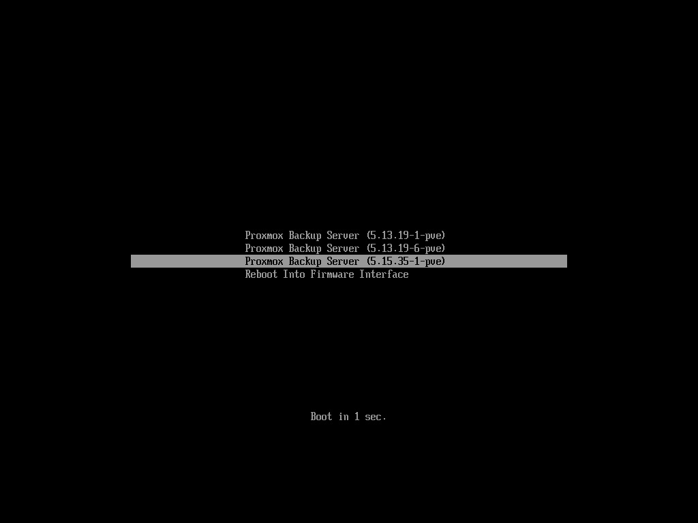

.. _chapter-systembooting:

Host Bootloader
---------------

`Proxmox Backup`_ currently uses one of two bootloaders, depending on the disk setup
selected in the installer.

For EFI Systems installed with ZFS as the root filesystem ``systemd-boot`` is
used, unless Secure Boot is enabled. All other deployments use the standard
``grub`` bootloader (this usually also applies to systems which are installed
on top of Debian).

.. _systembooting-installer-part-scheme:

Partitioning Scheme Used by the Installer
~~~~~~~~~~~~~~~~~~~~~~~~~~~~~~~~~~~~~~~~~

The Proxmox Backup installer creates 3 partitions on all disks selected for
installation.

The created partitions are:

* A 1 MB BIOS Boot Partition (gdisk type EF02)

* A 512 MB EFI System Partition (ESP, gdisk type EF00)

* A third partition spanning the configured ``hdsize`` parameter or the
  remaining space available for the chosen storage type

Systems using ZFS as a root filesystem are booted with a kernel and initrd image
stored on the 512 MB EFI System Partition. For legacy BIOS systems, and EFI
systems with Secure Boot enabled, ``grub`` is used, for EFI systems without
Secure Boot, ``systemd-boot`` is used. Both are installed and configured to
point to the ESPs.

``grub`` in BIOS mode (``--target i386-pc``) is installed onto the BIOS Boot
Partition of all selected disks on all systems booted with ``grub`` (that is,
all installs with root on ``ext4`` or ``xfs``, and installs with root on ZFS on
non-EFI systems).

.. _systembooting-proxmox-boot-tool:

Synchronizing the Content of the ESP with ``proxmox-boot-tool``
~~~~~~~~~~~~~~~~~~~~~~~~~~~~~~~~~~~~~~~~~~~~~~~~~~~~~~~~~~~~~~~

``proxmox-boot-tool`` is a utility used to keep the contents of the EFI System
Partitions properly configured and synchronized. It copies certain kernel
versions to all ESPs and configures the respective bootloader to boot from
the ``vfat`` formatted ESPs. In the context of ZFS as root filesystem, this means
that you can use all the optional features on your root pool, instead of the subset
which is also present in the ZFS implementation in ``grub`` or having to create a
small, separate boot-pool (see: `Booting ZFS on root with grub
<https://github.com/zfsonlinux/zfs/wiki/Debian-Stretch-Root-on-ZFS>`_).

In setups with redundancy, all disks are partitioned with an ESP by the
installer. This ensures the system boots, even if the first boot device fails
or if the BIOS can only boot from a particular disk.

The ESPs are not kept mounted during regular operation. This helps to prevent
filesystem corruption in the ``vfat`` formatted ESPs in case of a system crash,
and removes the need to manually adapt ``/etc/fstab`` in case the primary boot
device fails.

``proxmox-boot-tool`` handles the following tasks:

* Formatting and setting up a new partition
* Copying and configuring new kernel images and initrd images to all listed ESPs
* Synchronizing the configuration on kernel upgrades and other maintenance tasks
* Managing the list of kernel versions which are synchronized
* Configuring the boot-loader to boot a particular kernel version (pinning)

You can view the currently configured ESPs and their state by running:

.. code-block:: console

  # proxmox-boot-tool status

.. _systembooting-proxmox-boot-setup:

Setting up a New Partition for use as Synced ESP
^^^^^^^^^^^^^^^^^^^^^^^^^^^^^^^^^^^^^^^^^^^^^^^^

To format and initialize a partition as synced ESP, for example, after replacing a
failed vdev in an rpool, ``proxmox-boot-tool`` from ``proxmox-kernel-helper`` can be used.

.. WARNING:: the ``format`` command will format the ``<partition>``. Make sure
   to pass in the right device/partition!

For example, to format an empty partition ``/dev/sda2`` as ESP, run the following:

.. code-block:: console

  # proxmox-boot-tool format /dev/sda2

To setup an existing, unmounted ESP located on ``/dev/sda2`` for inclusion in
Proxmox Backup's kernel update synchronization mechanism, use the following:

.. code-block:: console

  # proxmox-boot-tool init /dev/sda2

or

.. code-block:: console

  # proxmox-boot-tool init /dev/sda2 grub

to force initialization with Grub instead of systemd-boot, for example for
Secure Boot support.

Following this, `/etc/kernel/proxmox-boot-uuids`` should contain a new line with the
UUID of the newly added partition. The ``init`` command will also automatically
trigger a refresh of all configured ESPs.

.. _systembooting-proxmox-boot-refresh:

Updating the Configuration on all ESPs
^^^^^^^^^^^^^^^^^^^^^^^^^^^^^^^^^^^^^^

To copy and configure all bootable kernels and keep all ESPs listed in
``/etc/kernel/proxmox-boot-uuids`` in sync, you just need to run:

.. code-block:: console

  # proxmox-boot-tool refresh

(Equivalent to running ``update-grub`` on systems with ``ext4`` or ``xfs`` on root).

This is necessary after making changes to the kernel commandline, or if you want
to sync all kernels and initrds.

.. NOTE:: Both ``update-initramfs`` and ``apt`` (when necessary) will automatically
   trigger a refresh.

Kernel Versions Considered by ``proxmox-boot-tool``
^^^^^^^^^^^^^^^^^^^^^^^^^^^^^^^^^^^^^^^^^^^^^^^^^^^

The following kernel versions are configured by default:

* The currently running kernel
* The version being newly installed on package updates
* The two latest, already installed kernels
* The latest version of the second-to-last kernel series (e.g. 5.0, 5.3), if applicable
* Any manually selected kernels

Manually Keeping a Kernel Bootable
^^^^^^^^^^^^^^^^^^^^^^^^^^^^^^^^^^

Should you wish to add a certain kernel and initrd image to the list of
bootable kernels, use ``proxmox-boot-tool kernel add``.

For example, run the following to add the kernel with ABI version ``5.0.15-1-pve``
to the list of kernels to keep installed and synced to all ESPs:

.. code-block:: console

  # proxmox-boot-tool kernel add 5.0.15-1-pve

``proxmox-boot-tool kernel list`` will list all kernel versions currently selected
for booting:

.. code-block:: console

  # proxmox-boot-tool kernel list
  Manually selected kernels:
  5.0.15-1-pve

  Automatically selected kernels:
  5.0.12-1-pve
  4.15.18-18-pve

Run ``proxmox-boot-tool kernel remove`` to remove a kernel from the list of
manually selected kernels, for example:

.. code-block:: console

  # proxmox-boot-tool kernel remove 5.0.15-1-pve

.. NOTE:: It's required to run ``proxmox-boot-tool refresh`` to update all EFI System
   Partitions (ESPs) after a manual kernel addition or removal from above.

.. _systembooting-determine-bootloader:

Determine which Bootloader is Used
~~~~~~~~~~~~~~~~~~~~~~~~~~~~~~~~~~

.. image:: images/screenshots/boot-grub.png
  :target: _images/boot-grub.png
  :align: left
  :alt: Grub boot screen

The simplest and most reliable way to determine which bootloader is used, is to
watch the boot process of the Proxmox Backup node.

You will either see the blue box of ``grub`` or the simple black on white
``systemd-boot``.

Determining the bootloader from a running system might not be 100% accurate. The
most reliable way is to run the following command:

.. code-block:: console

  # efibootmgr -v

If it returns a message that EFI variables are not supported, ``grub`` is used in
BIOS/Legacy mode.

If the output contains a line that looks similar to the following, ``grub`` is
used in UEFI mode.

.. code-block:: console

  Boot0005* proxmox	[...] File(\EFI\proxmox\grubx64.efi)

If the output contains a line similar to the following, ``systemd-boot`` is used.

.. code-block:: console

  Boot0006* Linux Boot Manager	[...] File(\EFI\systemd\systemd-bootx64.efi)

By running the following command, you can find out if ``proxmox-boot-tool`` is
configured, which is a good indication of how the system is booted:

.. code-block:: console

  # proxmox-boot-tool status

.. _systembooting-grub:

Grub
~~~~

``grub`` has been the de facto standard for booting Linux systems for many years
and is quite well documented
(see the `Grub Manual
<https://www.gnu.org/software/grub/manual/grub/grub.html>`_).

.. _systembooting-grub-config:

Configuration
^^^^^^^^^^^^^

Changes to the ``grub`` configuration are done via the defaults file
``/etc/default/grub`` or via config snippets in ``/etc/default/grub.d``. To
regenerate the configuration file after a change to the configuration, run:

.. code-block:: console

  # update-grub

.. NOTE:: Systems using ``proxmox-boot-tool`` will call
  ``proxmox-boot-tool refresh`` upon ``update-grub``

.. _systembooting-systemdboot:

Systemd-boot
~~~~~~~~~~~~

``systemd-boot`` is a lightweight EFI bootloader. It reads the kernel and initrd
images directly from the EFI Service Partition (ESP) where it is installed.
The main advantage of directly loading the kernel from the ESP is that it does
not need to reimplement the drivers for accessing the storage. In Proxmox
Backup, :ref:`proxmox-boot-tool <systembooting-proxmox-boot-tool>` is used to
keep the configuration on the ESPs synchronized.

.. _systembooting-systemd-boot-config:

Configuration
^^^^^^^^^^^^^

``systemd-boot`` is configured via the file ``loader/loader.conf`` in the root
directory of an EFI System Partition (ESP). See the ``loader.conf(5)`` manpage
for details.

Each bootloader entry is placed in a file of its own, in the directory
``loader/entries/``

An example entry.conf looks like this (``/`` refers to the root of the ESP):

.. code-block:: console

  title    Proxmox
  version  5.0.15-1-pve
  options   root=ZFS=rpool/ROOT/pve-1 boot=zfs
  linux    /EFI/proxmox/5.0.15-1-pve/vmlinuz-5.0.15-1-pve
  initrd   /EFI/proxmox/5.0.15-1-pve/initrd.img-5.0.15-1-pve

.. _systembooting-edit-kernel-cmdline:

Editing the Kernel Commandline
~~~~~~~~~~~~~~~~~~~~~~~~~~~~~~

You can modify the kernel commandline in the following places, depending on the
bootloader used:

.. _systembooting-kernel-cmdline-grub:

Grub
^^^^

The kernel commandline needs to be placed in the variable
``GRUB_CMDLINE_LINUX_DEFAULT`` in the file ``/etc/default/grub``. Running
``update-grub`` appends its content to all ``linux`` entries in
``/boot/grub/grub.cfg``.

.. _systembooting-kernel-cmdline-systemd-boot:

systemd-boot
^^^^^^^^^^^^

The kernel commandline needs to be placed as one line in ``/etc/kernel/cmdline``.
To apply your changes, run ``proxmox-boot-tool refresh``, which sets it as the
``option`` line for all config files in ``loader/entries/proxmox-*.conf``.

.. _systembooting-kernel-pin:

Override the Kernel-Version for next Boot
~~~~~~~~~~~~~~~~~~~~~~~~~~~~~~~~~~~~~~~~~

To select a kernel that is not currently the default kernel, you can either:

* Use the boot loader menu that is displayed at the beginning of the boot
  process
* Use the ``proxmox-boot-tool`` to ``pin`` the system to a kernel version either
  once or permanently (until pin is reset).

This should help you work around incompatibilities between a newer kernel
version and the hardware.

.. NOTE:: Such a pin should be removed as soon as possible, so that all recent
   security patches from the latest kernel are also applied to the system.

For example, to permanently select the version ``5.15.30-1-pve`` for booting, you
would run:

.. code-block:: console

  # proxmox-boot-tool kernel pin 5.15.30-1-pve

.. TIP:: The pinning functionality works for all Proxmox Backup systems, not only those using
   ``proxmox-boot-tool`` to synchronize the contents of the ESPs, if your system
   does not use ``proxmox-boot-tool`` for synchronizing, you can also skip the
   ``proxmox-boot-tool refresh`` call in the end.

You can also set a kernel version to be booted on the next system boot only.
This is useful, for example, to test if an updated kernel has resolved an issue,
which caused you to ``pin`` a version in the first place:

.. code-block:: console

  # proxmox-boot-tool kernel pin 5.15.30-1-pve --next-boot

To remove any pinned version configuration, use the ``unpin`` subcommand:

.. code-block:: console

  # proxmox-boot-tool kernel unpin

While ``unpin`` has a ``--next-boot`` option as well, it is used to clear a pinned
version set with ``--next-boot``. As that happens already automatically on boot,
invoking it manually is of little use.

After setting or clearing pinned versions, you also need to synchronize the
content and configuration on the ESPs by running the ``refresh`` subcommand.

.. TIP:: You will be prompted to automatically do for  ``proxmox-boot-tool`` managed
   systems if you call the tool interactively.

.. code-block:: console

  # proxmox-boot-tool refresh

.. _systembooting-secure-boot:

Secure Boot
~~~~~~~~~~~

Since Proxmox Backup 3.1, Secure Boot is supported out of the box via signed
packages and integration in ``proxmox-boot-tool``.

The following packages need to be installed for Secure Boot to be enabled:

* ``shim-signed`` (shim bootloader signed by Microsoft)
* ``shim-helpers-amd64-signed`` (fallback bootloader and MOKManager, signed by Proxmox)
* ``grub-efi-amd64-signed`` (Grub EFI bootloader, signed by Proxmox)
* ``proxmox-kernel-6.X.Y-Z-pve-signed`` (Kernel image, signed by Proxmox)

Only Grub as bootloader is supported out of the box, since there are no other
pre-signed bootloader packages available. Any new installation of Proxmox Backup
will automatically have all of the above packages included.

More details about how Secure Boot works, and how to customize the setup, are
available in `our wiki <https://pve.proxmox.com/wiki/Secure_Boot_Setup>`_.

.. _systembooting-secure-boot-existing-installation:

Switching an Existing Installation to Secure Boot
^^^^^^^^^^^^^^^^^^^^^^^^^^^^^^^^^^^^^^^^^^^^^^^^^

.. WARNING:: This can lead to an unbootable installation in some cases if not
   done correctly. Reinstalling the host will setup Secure Boot automatically if
   available, without any extra interactions. **Make sure you have a working and
   well-tested backup of your Proxmox Backup host!**

An existing UEFI installation can be switched over to Secure Boot if desired,
without having to reinstall Proxmox Backup from scratch.

First, ensure all your system is up-to-date. Next, install all the required
pre-signed packages as listed above. Grub automatically creates the needed EFI
boot entry for booting via the default shim.

.. _systembooting-secure-boot-existing-systemd-boot:

**systemd-boot**
""""""""""""""""

If ``systemd-boot`` is used as a bootloader (see
:ref:`Determine which Bootloader is used <systembooting-determine-bootloader>`),
some additional setup is needed. This is only the case if Proxmox Backup was
installed with ZFS-on-root.

To check the latter, run:

.. code-block:: console

  # findmnt /

If the host is indeed using ZFS as root filesystem, the ``FSTYPE`` column should
contain ``zfs``:

.. code-block:: console

  TARGET SOURCE           FSTYPE OPTIONS
  /      rpool/ROOT/pbs-1 zfs    rw,relatime,xattr,noacl

Next, a suitable potential ESP (EFI system partition) must be found. This can be
done using the ``lsblk`` command as following:

.. code-block:: console

  # lsblk -o +FSTYPE

The output should look something like this:

.. code-block:: console

  NAME   MAJ:MIN RM  SIZE RO TYPE MOUNTPOINTS FSTYPE
  sda      8:0    0   32G  0 disk
  ├─sda1   8:1    0 1007K  0 part
  ├─sda2   8:2    0  512M  0 part             vfat
  └─sda3   8:3    0 31.5G  0 part             zfs_member
  sdb      8:16   0   32G  0 disk
  ├─sdb1   8:17   0 1007K  0 part
  ├─sdb2   8:18   0  512M  0 part             vfat
  └─sdb3   8:19   0 31.5G  0 part             zfs_member

In this case, the partitions ``sda2`` and ``sdb2`` are the targets. They can be
identified by the their size of 512M and their ``FSTYPE`` being ``vfat``, in
this case on a ZFS RAID-1 installation.

These partitions must be properly set up for booting through Grub using
``proxmox-boot-tool``. This command (using ``sda2`` as an example) must be run
separately for each individual ESP:

.. code-block:: console

  # proxmox-boot-tool init /dev/sda2 grub

Afterwards, you can sanity-check the setup by running the following command:

.. code-block:: console

  # efibootmgr -v

This list should contain an entry looking similar to this:

.. code-block:: console

  [..]
  Boot0009* proxmox       HD(2,GPT,..,0x800,0x100000)/File(\EFI\proxmox\shimx64.efi)
  [..]

.. NOTE:: The old ``systemd-boot`` bootloader will be kept, but Grub will be
   preferred. This way, if booting using Grub in Secure Boot mode does not work
   for any reason, the system can still be booted using ``systemd-boot`` with
   Secure Boot turned off.

Now the host can be rebooted and Secure Boot enabled in the UEFI firmware setup
utility.

On reboot, a new entry named ``proxmox`` should be selectable in the UEFI
firmware boot menu, which boots using the pre-signed EFI shim.

If, for any reason, no ``proxmox`` entry can be found in the UEFI boot menu, you
can try adding it manually (if supported by the firmware), by adding the file
``\EFI\proxmox\shimx64.efi`` as a custom boot entry.

.. NOTE:: Some UEFI firmwares are known to drop the ``proxmox`` boot option on
   reboot. This can happen if the ``proxmox`` boot entry is pointing to a Grub
   installation on a disk, where the disk itself is not a boot option. If
   possible, try adding the disk as a boot option in the UEFI firmware setup
   utility and run ``proxmox-boot-tool`` again.

.. TIP:: To enroll custom keys, see the accompanying `Secure Boot wiki page
   <https://pve.proxmox.com/wiki/Secure_Boot_Setup#Setup_instructions_for_db_key_variant>`_.

.. _systembooting-secure-boot-other-modules:

Using DKMS/Third Party Modules With Secure Boot
^^^^^^^^^^^^^^^^^^^^^^^^^^^^^^^^^^^^^^^^^^^^^^^

On systems with Secure Boot enabled, the kernel will refuse to load modules
which are not signed by a trusted key. The default set of modules shipped with
the kernel packages is signed with an ephemeral key embedded in the kernel
image which is trusted by that specific version of the kernel image.

In order to load other modules, such as those built with DKMS or manually, they
need to be signed with a key trusted by the Secure Boot stack. The easiest way
to achieve this is to enroll them as Machine Owner Key (``MOK``) with
``mokutil``.

The ``dkms`` tool will automatically generate a keypair and certificate in
``/var/lib/dkms/mok.key`` and ``/var/lib/dkms/mok.pub`` and use it for signing
the kernel modules it builds and installs.

You can view the certificate contents with

.. code-block:: console

  # openssl x509 -in /var/lib/dkms/mok.pub -noout -text

and enroll it on your system using the following command:

.. code-block:: console

  # mokutil --import /var/lib/dkms/mok.pub
  input password:
  input password again:

The ``mokutil`` command will ask for a (temporary) password twice, this password
needs to be entered one more time in the next step of the process! Rebooting
the system should automatically boot into the ``MOKManager`` EFI binary, which
allows you to verify the key/certificate and confirm the enrollment using the
password selected when starting the enrollment using ``mokutil``. Afterwards,
the kernel should allow loading modules built with DKMS (which are signed with
the enrolled ``MOK``). The ``MOK`` can also be used to sign custom EFI binaries
and kernel images if desired.

The same procedure can also be used for custom/third-party modules not managed
with DKMS, but the key/certificate generation and signing steps need to be done
manually in that case.
