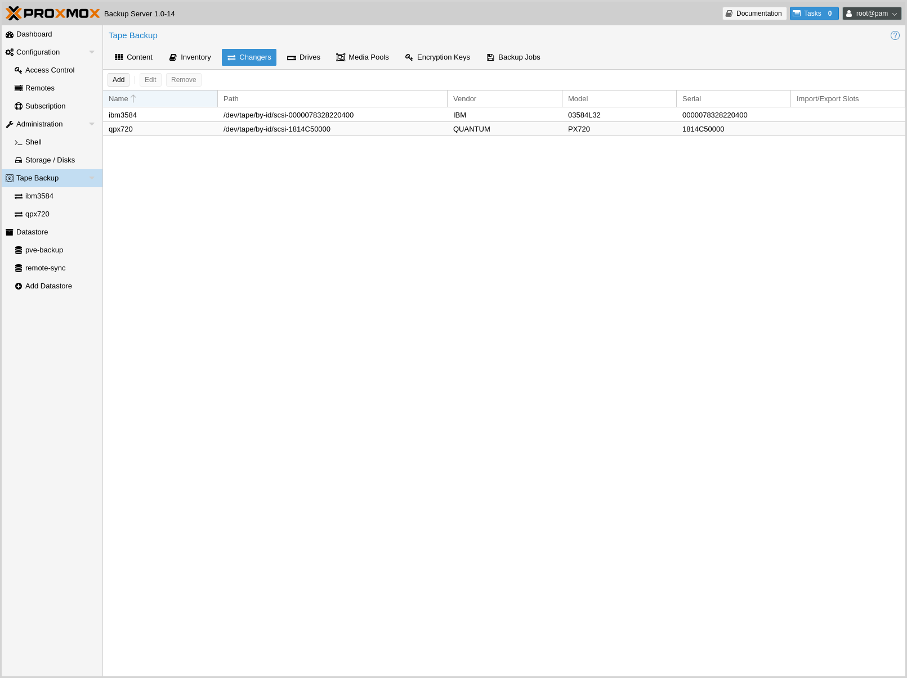
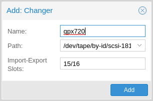
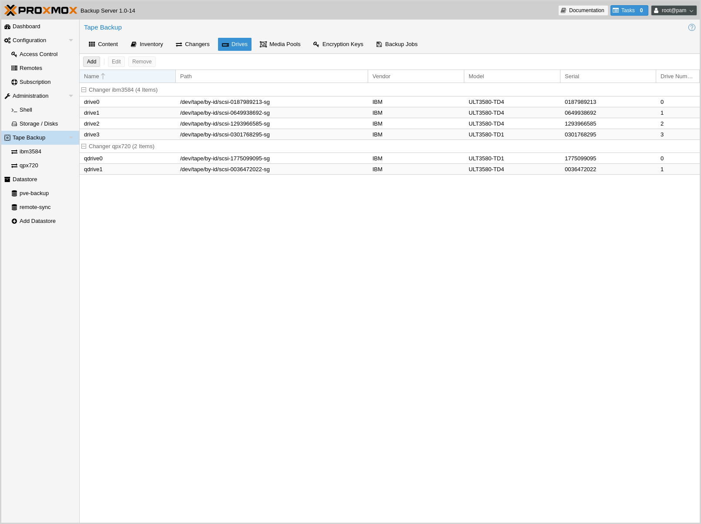
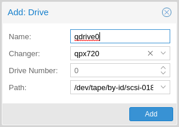
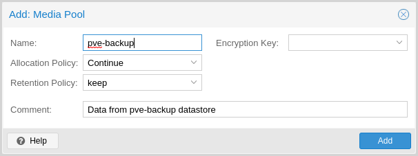
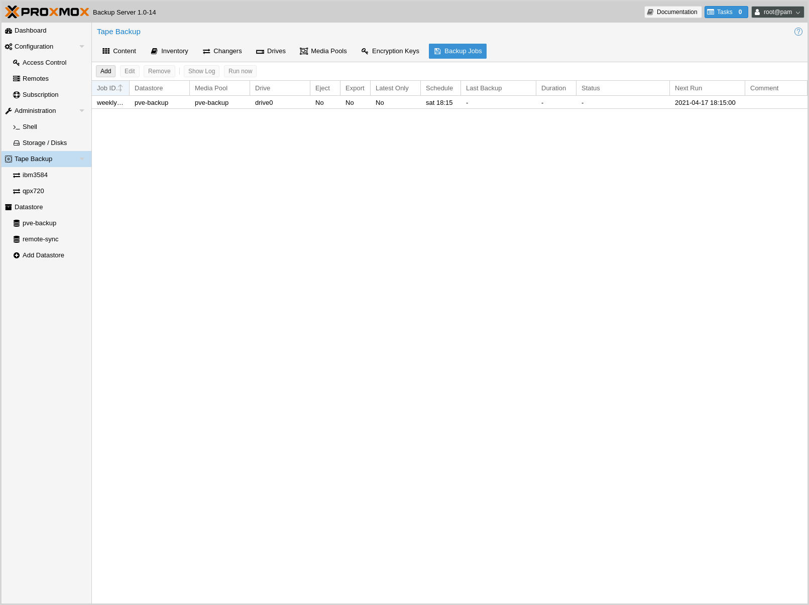
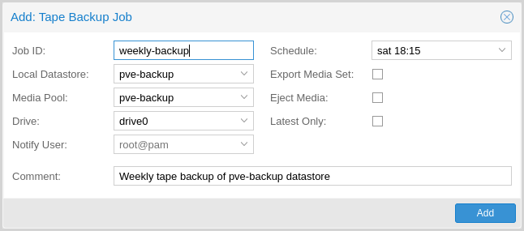
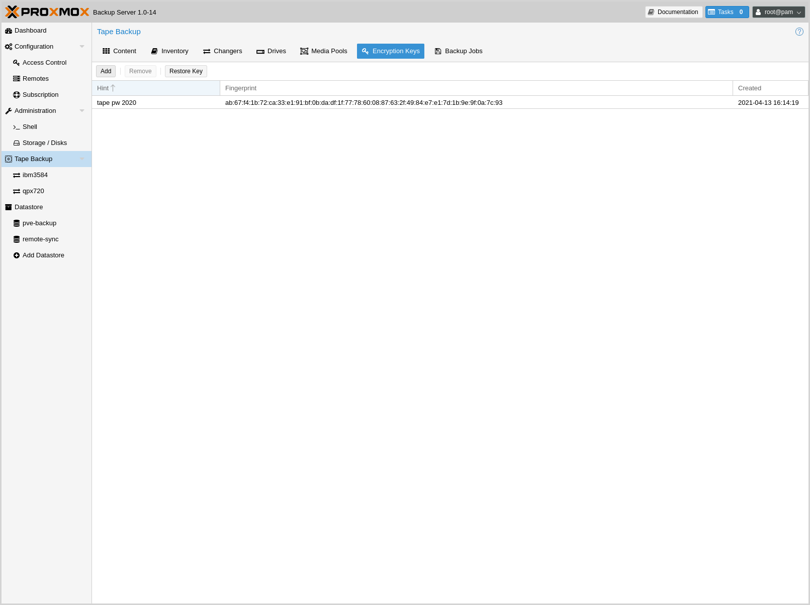

.. _tape_backup:

Tape Backup
===========

.. image:: images/screenshots/pbs-gui-tape-changer-overview.png
  :target: _images/pbs-gui-tape-changer-overview.png
  :align: right
  :alt: Tape Backup: Tape changer overview

Proxmox tape backup provides an easy way to store datastore content
onto magnetic tapes. This increases data safety because you get:

- an additional copy of the data,
- on a different media type (tape),
- to an additional location (you can move tapes off-site)

In most restore jobs, only data from the last backup job is restored.
Restore requests further decline, the older the data
gets. Considering this, tape backup may also help to reduce disk
usage, because you can safely remove data from disk, once it's archived on
tape. This is especially true if you need to retain data for several
years.

Tape backups do not provide random access to the stored data. Instead,
you need to restore the data to disk, before you can access it
again. Also, if you store your tapes off-site (using some kind of tape
vaulting service), you need to bring them back on-site, before you can do any
restores. So please consider that restoring from tape can take much
longer than restoring from disk.

Tape Technology Primer
----------------------

.. _Linear Tape-Open: https://en.wikipedia.org/wiki/Linear_Tape-Open

As of 2021, the only widely available tape technology standard is
`Linear Tape-Open`_ (LTO). Different vendors offer LTO Ultrium tape
drives, auto-loaders, and LTO tape cartridges.

There are a few vendors that offer proprietary drives with
slight advantages in performance and capacity. Nevertheless, they have
significant disadvantages:

- proprietary (single vendor)
- a much higher purchase cost

So we currently do not test such drives.

In general, LTO tapes offer the following advantages:

- Durability (30 year lifespan)
- High Capacity (12 TB)
- Relatively low cost per TB
- Cold Media
- Movable (storable inside vault)
- Multiple vendors (for both media and drives)
- Built in AES-GCM Encryption engine

Note that `Proxmox Backup Server` already stores compressed data, so using the
tape compression feature has no advantage.

Supported Hardware
------------------

`Proxmox Backup`_ Server supports `Linear Tape-Open`_ generation 5 (LTO-5)
or later and has best-effort support for generation 4 (LTO-4). While
many LTO-4 systems are known to work, some might need firmware updates or
do not implement necessary features to work with Proxmox Backup Server.

Tape changing is carried out using the SCSI Medium Changer protocol,
so all modern tape libraries should work.

.. Note:: We use a custom user space tape driver written in Rust_. This
   driver directly communicates with the tape drive using the SCSI
   generic interface. This may have negative side effects when used with the old
   Linux kernel tape driver, so you should not use that driver with
   Proxmox tape backup.

Drive Performance
~~~~~~~~~~~~~~~~~

Current LTO-8 tapes provide read/write speeds of up to 360 MB/s. This means,
that it still takes a minimum of 9 hours to completely write or
read a single tape (even at maximum speed).

The only way to speed that data rate up is to use more than one
drive. That way, you can run several backup jobs in parallel, or run
restore jobs while the other dives are used for backups.

Also consider that you first need to read data from your datastore
(disk). However, a single spinning disk is unable to deliver data at this
rate. We measured a maximum rate of about 60MB/s to 100MB/s in practice,
so it takes 33 hours to read the 12TB needed to fill up an LTO-8 tape. If you want
to write to your tape at full speed, please make sure that the source
datastore is able to deliver that performance (for example, by using SSDs).

LTO-9+ considerations
~~~~~~~~~~~~~~~~~~~~

Since LTO-9, it is necessary to initialize new media in your drives, this is
called `Media Optimization`. This usually takes between 40 and 120 minutes per
medium. It is recommended to initialize your media in this manner with the
tools provided by your hardware vendor of your drive or changer. Some tape
changers have a method to 'bulk' initialize your media.

Because of this, formatting tapes is handled differently in Proxmox Backup
Server to avoid re-optimizing on each format/labelling. If you want to format
your media for use with the Proxmox Backup Server the first time or after use
with another program, either use the functionality of your drive/changer, or
use the 'slow' format on the cli:

.. code-block:: console

 # proxmox-tape format --drive your-drive --fast 0

This will completely remove all pre-existing data and trigger a `Media
Optimization` pass.

If you format a partitioned LTO-9 medium with the 'fast' method (the default or
by setting `--fast 1`), only the first partition will be formatted, so make
sure to use the 'slow' method.

Terminology
-----------

**Tape Labels:**
  are used to uniquely identify a tape. You would normally apply a
  sticky paper label to the front of the cartridge. We additionally
  store the label text magnetically on the tape (first file on tape).

.. _Code 39: https://en.wikipedia.org/wiki/Code_39

.. _LTO Ultrium Cartridge Label Specification: https://www.ibm.com/support/pages/ibm-lto-ultrium-cartridge-label-specification

.. _LTO Barcode Generator: lto-barcode/index.html

**Barcodes:**
  are a special form of tape labels, which are electronically
  readable. Most LTO tape robots use an 8 character string encoded as
  `Code 39`_, as defined in the `LTO Ultrium Cartridge Label
  Specification`_.

  You can either buy such barcode labels from your cartridge vendor,
  or print them yourself. You can use our `LTO Barcode Generator`_
  app, if you would like to print them yourself.

  .. Note:: Physical labels and the associated adhesive should have an
     environmental performance to match or exceed the environmental
     specifications of the cartridge to which it is applied.

**Media Pools:**
  A media pool is a logical container for tapes. A backup job targets
  one media pool, so a job only uses tapes from that pool. The pool
  additionally defines how long a backup job can append data to tapes
  (allocation policy) and how long you want to keep the data
  (retention policy).

**Media Set:**
  A group of continuously written tapes (all from the same media pool).

**Tape drive:**
  The device used to read and write data to the tape. There are
  standalone drives, but drives are usually shipped within tape
  libraries.

**Tape changer:**
  A device which can change the tapes inside a tape drive (tape
  robot). They are usually part of a tape library.

.. _Tape Library: https://en.wikipedia.org/wiki/Tape_library

`Tape library`_:
  A storage device that contains one or more tape drives, a number of
  slots to hold tape cartridges, a barcode reader to identify tape
  cartridges, and an automated method for loading tapes (a robot).

  This is also commonly known as an 'autoloader', 'tape robot' or
  'tape jukebox'.

**Inventory:**
  The inventory stores the list of known tapes (with additional status
  information).

**Catalog:**
  A media catalog stores information about the media content.

Tape Quick Start
----------------

1. Configure your tape hardware (drives and changers)

2. Configure one or more media pools

3. Label your tape cartridges

4. Start your first tape backup job ...

Configuration
-------------

Please note that you can configure anything using the graphical user
interface or the command-line interface. Both methods result in the
same configuration.

.. _tape_changer_config:

Tape changers
~~~~~~~~~~~~~

Tape changers (robots) are part of a `Tape Library`_. They contain a number of
slots to hold tape cartridges, a barcode reader to identify tape cartridges and
an automated method for loading tapes.

You can skip this step if you are using a standalone drive.

Linux is able to auto detect these devices, and you can get a list
of available devices using:

.. code-block:: console

 # proxmox-tape changer scan
 ┌─────────────────────────────┬─────────┬──────────────┬────────┐
 │ path                        │ vendor  │ model        │ serial │
 ╞═════════════════════════════╪═════════╪══════════════╪════════╡
 │ /dev/tape/by-id/scsi-CC2C52 │ Quantum │ Superloader3 │ CC2C52 │
 └─────────────────────────────┴─────────┴──────────────┴────────┘

In order to use a device with Proxmox Backup Server, you need to create a
configuration entry:

.. code-block:: console

 # proxmox-tape changer create sl3 --path /dev/tape/by-id/scsi-CC2C52

Where ``sl3`` is an arbitrary name you can choose.

.. Note:: Please use the persistent device path names from inside
   ``/dev/tape/by-id/``. Names like ``/dev/sg0`` may point to a
   different device after reboot, and that is not what you want.

This operation can also be carried out from the GUI, by navigating to the
**Changers** tab of **Tape Backup** and clicking **Add**.

You can display the final configuration with:

.. code-block:: console

 # proxmox-tape changer config sl3
 ┌──────┬─────────────────────────────┐
 │ Name │ Value                       │
 ╞══════╪═════════════════════════════╡
 │ name │ sl3                         │
 ├──────┼─────────────────────────────┤
 │ path │ /dev/tape/by-id/scsi-CC2C52 │
 └──────┴─────────────────────────────┘

Or simply list all configured changer devices (as seen in the **Changers** tab
of the GUI):

.. code-block:: console

 # proxmox-tape changer list
 ┌──────┬─────────────────────────────┬─────────┬──────────────┬────────────┐
 │ name │ path                        │ vendor  │ model        │ serial     │
 ╞══════╪═════════════════════════════╪═════════╪══════════════╪════════════╡
 │ sl3  │ /dev/tape/by-id/scsi-CC2C52 │ Quantum │ Superloader3 │ CC2C52     │
 └──────┴─────────────────────────────┴─────────┴──────────────┴────────────┘

The Vendor, Model and Serial number are auto-detected, but only shown
if the device is online.

To test your setup, please query the status of the changer device with:

.. code-block:: console

 # proxmox-tape changer status sl3
 ┌───────────────┬──────────┬────────────┬─────────────┐
 │ entry-kind    │ entry-id │ changer-id │ loaded-slot │
 ╞═══════════════╪══════════╪════════════╪═════════════╡
 │ drive         │        0 │ vtape1     │           1 │
 ├───────────────┼──────────┼────────────┼─────────────┤
 │ slot          │        1 │            │             │
 ├───────────────┼──────────┼────────────┼─────────────┤
 │ slot          │        2 │ vtape2     │             │
 ├───────────────┼──────────┼────────────┼─────────────┤
 │ ...           │      ... │            │             │
 ├───────────────┼──────────┼────────────┼─────────────┤
 │ slot          │       16 │            │             │
 └───────────────┴──────────┴────────────┴─────────────┘

Tape libraries usually provide some special import/export slots (also
called "mail slots"). Tapes inside those slots are accessible from
outside, making it easy to add/remove tapes to/from the library. Those
tapes are considered to be "offline", so backup jobs will not use
them. Those special slots are auto-detected and marked as an
``import-export`` slot in the status command.

It's worth noting that some of the smaller tape libraries don't have
such slots. While they have something called a "Mail Slot", that slot
is just a way to grab the tape from the gripper. They are unable
to hold media while the robot does other things. They also do not
expose that "Mail Slot" over the SCSI interface, so you won't see them in
the status output.

As a workaround, you can mark some of the normal slots as export
slot. The software treats those slots like real ``import-export``
slots, and the media inside those slots are considered to be 'offline'
(not available for backup):

.. code-block:: console

 # proxmox-tape changer update sl3 --export-slots 15,16

After that, you can see those artificial ``import-export`` slots in
the status output:

.. code-block:: console

 # proxmox-tape changer status sl3
 ┌───────────────┬──────────┬────────────┬─────────────┐
 │ entry-kind    │ entry-id │ changer-id │ loaded-slot │
 ╞═══════════════╪══════════╪════════════╪═════════════╡
 │ drive         │        0 │ vtape1     │           1 │
 ├───────────────┼──────────┼────────────┼─────────────┤
 │ import-export │       15 │            │             │
 ├───────────────┼──────────┼────────────┼─────────────┤
 │ import-export │       16 │            │             │
 ├───────────────┼──────────┼────────────┼─────────────┤
 │ slot          │        1 │            │             │
 ├───────────────┼──────────┼────────────┼─────────────┤
 │ slot          │        2 │ vtape2     │             │
 ├───────────────┼──────────┼────────────┼─────────────┤
 │ ...           │      ... │            │             │
 ├───────────────┼──────────┼────────────┼─────────────┤
 │ slot          │       14 │            │             │
 └───────────────┴──────────┴────────────┴─────────────┘

Advanced options
^^^^^^^^^^^^^^^^

Since not all tape changer behave the same, there is sometimes the need
for configuring advanced options.

Currently there are the following:

* `eject-before-unload` : This is needed for some changers that require a tape
  to be ejected before unloading from the drive.

You can set these options with `proxmox-tape` like this:

.. code-block:: console

 # proxmox-tape changer update sl3 --eject-before-unload true

.. _tape_drive_config:

Tape drives
~~~~~~~~~~~

Linux is able to auto detect tape drives, and you can get a list
of available tape drives using:

.. code-block:: console

 # proxmox-tape drive scan
 ┌────────────────────────────────┬────────┬─────────────┬────────┐
 │ path                           │ vendor │ model       │ serial │
 ╞════════════════════════════════╪════════╪═════════════╪════════╡
 │ /dev/tape/by-id/scsi-12345-sg  │ IBM    │ ULT3580-TD4 │  12345 │
 └────────────────────────────────┴────────┴─────────────┴────────┘

In order to use that drive with Proxmox, you need to create a
configuration entry. This can be done through **Tape Backup -> Drives** in the
GUI or by using the command below:

.. code-block:: console

 # proxmox-tape drive create mydrive --path  /dev/tape/by-id/scsi-12345-sg

.. Note:: Please use the persistent device path names from inside
   ``/dev/tape/by-id/``. Names like ``/dev/sg0`` may point to a
   different device after reboot, and that is not what you want.

If you have a tape library, you also need to set the associated
changer device:

.. code-block:: console

 # proxmox-tape drive update mydrive --changer sl3  --changer-drivenum 0

The ``--changer-drivenum`` is only necessary if the tape library
includes more than one drive (the changer status command lists all
drive numbers).

You can display the final configuration with:

.. code-block:: console

 # proxmox-tape drive config mydrive
 ┌─────────┬────────────────────────────────┐
 │ Name    │ Value                          │
 ╞═════════╪════════════════════════════════╡
 │ name    │ mydrive                        │
 ├─────────┼────────────────────────────────┤
 │ path    │ /dev/tape/by-id/scsi-12345-sg  │
 ├─────────┼────────────────────────────────┤
 │ changer │ sl3                            │
 └─────────┴────────────────────────────────┘

.. NOTE:: The ``changer-drivenum`` value 0 is not stored in the
   configuration, because it is the default.

To list all configured drives use:

.. code-block:: console

 # proxmox-tape drive list
 ┌──────────┬────────────────────────────────┬─────────┬────────┬─────────────┬────────┐
 │ name     │ path                           │ changer │ vendor │ model       │ serial │
 ╞══════════╪════════════════════════════════╪═════════╪════════╪═════════════╪════════╡
 │ mydrive  │ /dev/tape/by-id/scsi-12345-sg  │ sl3     │ IBM    │ ULT3580-TD4 │ 12345  │
 └──────────┴────────────────────────────────┴─────────┴────────┴─────────────┴────────┘

The Vendor, Model and Serial number are auto detected and only shown
if the device is online.

For testing, you can simply query the drive status with:

.. code-block:: console

 # proxmox-tape status --drive mydrive
 ┌────────────────┬──────────────────────────┐
 │ Name           │ Value                    │
 ╞════════════════╪══════════════════════════╡
 │ blocksize      │ 0                        │
 ├────────────────┼──────────────────────────┤
 │ density        │ LTO4                     │
 ├────────────────┼──────────────────────────┤
 │ compression    │ 1                        │
 ├────────────────┼──────────────────────────┤
 │ buffer-mode    │ 1                        │
 ├────────────────┼──────────────────────────┤
 │ alert-flags    │ (empty)                  │
 ├────────────────┼──────────────────────────┤
 │ file-number    │ 0                        │
 ├────────────────┼──────────────────────────┤
 │ block-number   │ 0                        │
 ├────────────────┼──────────────────────────┤
 │ manufactured   │ Fri Dec 13 01:00:00 2019 │
 ├────────────────┼──────────────────────────┤
 │ bytes-written  │ 501.80 GiB               │
 ├────────────────┼──────────────────────────┤
 │ bytes-read     │ 4.00 MiB                 │
 ├────────────────┼──────────────────────────┤
 │ medium-passes  │ 20                       │
 ├────────────────┼──────────────────────────┤
 │ medium-wearout │ 0.12%                    │
 ├────────────────┼──────────────────────────┤
 │ volume-mounts  │ 2                        │
 └────────────────┴──────────────────────────┘

.. NOTE:: Blocksize should always be 0 (variable block size
   mode). This is the default anyway.

.. _tape_media_pool_config:

Media Pools
~~~~~~~~~~~

.. image:: images/screenshots/pbs-gui-tape-pools.png
  :target: _images/pbs-gui-tape-pools.png
  :align: right
  :alt: Tape Backup: Media Pools

A media pool is a logical container for tapes. A backup job targets
a single media pool, so a job only uses tapes from that pool.

.. topic:: Media Set

   A media set is a group of continuously written tapes, used to split
   the larger pool into smaller, restorable units. One or more backup
   jobs write to a media set, producing an ordered group of
   tapes. Media sets are identified by a unique ID. That ID and the
   sequence number are stored on each tape of that set (tape label).

   Media sets are the basic unit for restore tasks. This means that you need
   every tape in the set to restore the media set contents. Data is fully
   deduplicated inside a media set.

.. topic:: Media Set Allocation Policy

   The pool additionally defines how long backup jobs can append data
   to a media set. The following settings are possible:

   - Try to use the current media set (``continue``).

     This setting produces one large media set. While this is very
     space efficient (deduplication, no unused space), it can lead to
     long restore times, because restore jobs need to read all tapes in the
     set.

     .. NOTE:: Data is fully deduplicated inside a media set. This
        also means that data is randomly distributed over the tapes in
        the set. Thus, even if you restore a single VM, data may have to be
        read from all tapes inside the media set.

     Larger media sets are also more error-prone, because a single
     damaged tape makes the restore fail.

     Usage scenario: Mostly used with tape libraries. You manually
     trigger new set creation by running a backup job with the
     ``--export`` option.

     .. NOTE:: Retention period starts with the existence of a newer
        media set.

   - Always create a new media set (``always``).

     With this setting, each backup job creates a new media set. This
     is less space efficient, because the media from the last set
     may not be fully written, leaving the remaining space unused.

     The advantage is that this produces media sets of minimal
     size. Small sets are easier to handle, can be moved more conveniently
     to an off-site vault, and can be restored much faster.

     .. NOTE:: Retention period starts with the creation time of the
        media set.

   - Create a new set when the specified Calendar Event triggers.

     .. _systemd.time manpage: https://manpages.debian.org/buster/systemd/systemd.time.7.en.html

     This allows you to specify points in time by using systemd like
     Calendar Event specifications (see `systemd.time manpage`_).

     For example, the value ``weekly`` (or ``Mon *-*-* 00:00:00``)
     will create a new set each week.

     This balances between space efficiency and media count.

     .. NOTE:: Retention period starts on the creation time of the next
        media-set or, if that does not exist, when the calendar event
        next triggers after the current media-set start time.

   Additionally, the following events may allocate a new media set:

   - Required tape is offline (and you use a tape library).

   - Current set contains damaged or retired tapes.

   - Media pool encryption has changed

   - Database consistency errors, for example, if the inventory does not
     contain the required media information, or it contains conflicting
     information (outdated data).

.. topic:: Retention Policy

   Defines how long we want to keep the data.

   - Always overwrite media.

   - Protect data for the duration specified.

     We use systemd like time spans to specify durations, e.g. ``2
     weeks`` (see `systemd.time manpage`_).

   - Never overwrite data.

.. topic:: Hardware Encryption

   LTO-4 (or later) tape drives support hardware encryption. If you
   configure the media pool to use encryption, all data written to the
   tapes is encrypted using the configured key.

   This way, unauthorized users cannot read data from the media,
   for example, if you loose a tape while shipping to an offsite location.

   .. Note:: If the backup client also encrypts data, data on the tape
      will be double encrypted.

   The password protected key is stored on each medium, so that it is
   possible to `restore the key <tape_restore_encryption_key_>`_ using
   the password. Please make sure to remember the password, in case
   you need to restore the key.

To create a new media pool, add one from **Tape Backup -> Media Pools** in the
GUI, or enter the following command:

.. code-block:: console

 // proxmox-tape pool create <name> --drive <string> [OPTIONS]

 # proxmox-tape pool create daily --drive mydrive

Additional options can be set later, using the update command:

.. code-block:: console

 # proxmox-tape pool update daily --allocation daily --retention 7days

To list all configured pools use:

.. code-block:: console

 # proxmox-tape pool list
 ┌───────┬──────────┬────────────┬───────────┬──────────┐
 │ name  │ drive    │ allocation │ retention │ template │
 ╞═══════╪══════════╪════════════╪═══════════╪══════════╡
 │ daily │ mydrive  │ daily      │ 7days     │          │
 └───────┴──────────┴────────────┴───────────┴──────────┘

.. _tape_backup_job_config:

Tape Backup Jobs
~~~~~~~~~~~~~~~~

To automate tape backup, you can configure tape backup jobs which
write datastore content to a media pool, based on a specific time schedule.
The required settings are:

- ``store``: The datastore you want to backup

- ``pool``: The media pool - only tape cartridges from that pool are
  used.

- ``drive``: The tape drive.

- ``schedule``: Job schedule (see :ref:`calendar-event-scheduling`)

For example, to configure a tape backup job for datastore ``vmstore1``
use:

.. code-block:: console

 # proxmox-tape backup-job create job2 --store vmstore1 \
   --pool yourpool --drive yourdrive --schedule daily

The backup includes all snapshots from a backup group by default. You can
set the ``latest-only`` flag to include only the latest snapshots:

.. code-block:: console

 # proxmox-tape backup-job update job2 --latest-only

Backup jobs can use email to send tape request notifications or
report errors. You can set the notification user with:

.. code-block:: console

 # proxmox-tape backup-job update job2 --notify-user root@pam

.. Note:: The email address is a property of the user (see :ref:`user_mgmt`).

It is sometimes useful to eject the tape from the drive after a
backup. For a standalone drive, the ``eject-media`` option ejects the
tape, making sure that the following backup cannot use the tape
(unless someone manually loads the tape again). For tape libraries,
this option unloads the tape to a free slot, which provides better
dust protection than inside a drive:

.. code-block:: console

 # proxmox-tape backup-job update job2 --eject-media

.. Note:: For failed jobs, the tape remains in the drive.

For tape libraries, the ``export-media-set`` option moves all tapes from
the media set to an export slot, making sure that the following backup
cannot use the tapes. An operator can pick up those tapes and move them
to a vault.

.. code-block:: console

 # proxmox-tape backup-job update job2 --export-media-set

.. Note:: The ``export-media-set`` option can be used to force the start
   of a new media set, because tapes from the current set are no
   longer online.

It is also possible to run backup jobs manually:

.. code-block:: console

 # proxmox-tape backup-job run job2

To remove a job, please use:

.. code-block:: console

 # proxmox-tape backup-job remove job2

By default, all (recursive) namespaces of the datastore are included in a tape
backup. You can specify a single namespace with ``ns`` and a depth with
``max-depth``. For example:

.. code-block:: console

 # proxmox-tape backup-job update job2 --ns mynamespace --max-depth 3

If no `max-depth` is given, it will include all recursive namespaces.

This same functionality also exists in the GUI, under the **Backup Jobs** tab of
**Tape Backup**, where *Local Datastore* relates to the datastore you want to
backup and *Media Pool* is the pool to back up to.

Administration
--------------

Many sub-commands of the ``proxmox-tape`` command-line tools take a
parameter called ``--drive``, which specifies the tape drive you want
to work on. For convenience, you can set this in an environment
variable:

.. code-block:: console

 # export PROXMOX_TAPE_DRIVE=mydrive

You can then omit the ``--drive`` parameter from the command. If the
drive has an associated changer device, you may also omit the changer
parameter from commands that need a changer device, for example:

.. code-block:: console

 # proxmox-tape changer status

should display the changer status of the changer device associated with
drive ``mydrive``.

Label Tapes
~~~~~~~~~~~

By default, tape cartridges all look the same, so you need to put a
label on them for unique identification. First, put a sticky paper
label with some human readable text on the cartridge.

If you use a `Tape Library`_, you should use an 8 character string
encoded as `Code 39`_, as defined in the `LTO Ultrium Cartridge Label
Specification`_. You can either buy such barcode labels from your
cartridge vendor, or print them yourself. You can use our `LTO Barcode
Generator`_ app to print them.

Next, you need to write that same label text to the tape, so that the
software can uniquely identify the tape too.

For a standalone drive, manually insert the new tape cartridge into the
drive and run:

.. code-block:: console

 # proxmox-tape label --changer-id <label-text> [--pool <pool-name>]

You may omit the ``--pool`` argument to allow the tape to be used by any pool.

.. Note:: For safety reasons, this command fails if the tape contains
   any data. If you want to overwrite it anyway, erase the tape first.

You can verify success by reading back the label:

.. code-block:: console

 # proxmox-tape read-label
 ┌─────────────────┬──────────────────────────────────────┐
 │ Name            │ Value                                │
 ╞═════════════════╪══════════════════════════════════════╡
 │ changer-id      │ vtape1                               │
 ├─────────────────┼──────────────────────────────────────┤
 │ uuid            │ 7f42c4dd-9626-4d89-9f2b-c7bc6da7d533 │
 ├─────────────────┼──────────────────────────────────────┤
 │ ctime           │ Wed Jan  6 09:07:51 2021             │
 ├─────────────────┼──────────────────────────────────────┤
 │ pool            │ daily                                │
 ├─────────────────┼──────────────────────────────────────┤
 │ media-set-uuid  │ 00000000-0000-0000-0000-000000000000 │
 ├─────────────────┼──────────────────────────────────────┤
 │ media-set-ctime │ Wed Jan  6 09:07:51 2021             │
 └─────────────────┴──────────────────────────────────────┘

.. NOTE:: The ``media-set-uuid`` using all zeros indicates an empty
   tape (not used by any media set).

If you have a tape library, apply the sticky barcode label to the tape
cartridges first. Then load those empty tapes into the library. You
can then label all unlabeled tapes with a single command:

.. code-block:: console

 # proxmox-tape barcode-label [--pool <pool-name>]

Run Tape Backups
~~~~~~~~~~~~~~~~

To manually run a backup job click *Run Now* in the GUI or use the command:

.. code-block:: console

 # proxmox-tape backup <store> <pool> [OPTIONS]

The following options are available:

--eject-media  Eject media upon job completion.

  It is normally good practice to eject the tape after use. This unmounts the
  tape from the drive and prevents the tape from getting dusty.

--export-media-set  Export media set upon job completion.

  After a successful backup job, this moves all tapes from the used
  media set into import-export slots. The operator can then pick up
  those tapes and move them to a media vault.

--ns  The namespace to backup.

  Used if you only want to backup a specific namespace. If omitted, the root
  namespace is assumed.

--max-depth  The depth to recurse namespaces.

  ``0`` means no recursion at all (only the given namespace). If omitted,
  all namespaces are recursed (below the given one).

Restore from Tape
~~~~~~~~~~~~~~~~~

Restore is done at media-set granularity, so you first need to find
out which media set contains the data you want to restore. This
information is stored in the media catalog. If you do not have media
catalogs, you need to restore them first. Please note that you need
the catalog to find your data, but restoring a complete media-set does
not need media catalogs.

The following command lists the media content (from catalog):

.. code-block:: console

 # proxmox-tape media content
 ┌────────────┬──────┬──────────────────────────┬────────┬────────────────────────────────┬──────────────────────────────────────┐
 │ label-text │ pool │ media-set-name           │ seq-nr │ snapshot                       │ media-set-uuid                       │
 ╞════════════╪══════╪══════════════════════════╪════════╪════════════════════════════════╪══════════════════════════════════════╡
 │ TEST01L8   │ p2   │ Wed Jan 13 13:55:55 2021 │      0 │ vm/201/2021-01-11T10:43:48Z    │ 9da37a55-aac7-4deb-91c6-482b3b675f30 │
 ├────────────┼──────┼──────────────────────────┼────────┼────────────────────────────────┼──────────────────────────────────────┤
 │        ... │ ...  │                      ... │    ... │ ...                            │                                  ... │
 └────────────┴──────┴──────────────────────────┴────────┴────────────────────────────────┴──────────────────────────────────────┘

A restore job reads the data from the media set and moves it back to
data disk (datastore):

.. code-block:: console

 // proxmox-tape restore <media-set-uuid> <datastore>

 # proxmox-tape restore 9da37a55-aac7-4deb-91c6-482b3b675f30 mystore

Single Snapshot Restore
^^^^^^^^^^^^^^^^^^^^^^^

Sometimes it is not necessary to restore an entire media-set, but only some
specific snapshots from the tape. This can be achieved with the ``snapshots``
parameter:

.. code-block:: console

 // proxmox-tape restore <media-set-uuid> <datastore> [<snapshot>]

 # proxmox-tape restore 9da37a55-aac7-4deb-91c6-482b3b675f30 mystore sourcestore:host/hostname/2022-01-01T00:01:00Z

This first restores the snapshot to a temporary location, then restores the relevant
chunk archives, and finally restores the snapshot data to the target datastore.

The ``snapshot`` parameter can be passed multiple times, in order to restore
multiple snapshots with one restore action.

.. NOTE:: When using the single snapshot restore, the tape must be traversed
   more than once, which, if you restore many snapshots at once, can take longer
   than restoring the whole datastore.

Namespaces
^^^^^^^^^^

It is also possible to select and map specific namespaces from a media-set
during a restore. This is possible with the ``namespaces`` parameter.
The format for the parameter is:

.. code-block:: console

 store=<source-datastore>[,source=<source-ns>][,target=<target-ns>][,max-depth=<depth>]

If ``source`` or ``target`` is not given, the root namespace is assumed.
When no ``max-depth`` is given, the source namespace will be fully recursed.

An example restore command:

.. code-block:: console

 # proxmox-tape restore 9da37a55-aac7-4deb-91c6-482b3b675f30 mystore --namespaces store=sourcedatastore,source=ns1,target=ns2,max-depth=2

The parameter can be given multiple times. It can also be combined with the
``snapshots`` parameter to only restore those snapshots and map them to different
namespaces.

Update Inventory
~~~~~~~~~~~~~~~~

Restore Catalog
~~~~~~~~~~~~~~~

To restore a catalog from an existing tape, just insert the tape into the drive
and execute:

.. code-block:: console

  # proxmox-tape catalog

You can restore from a tape even without an existing catalog, but only the
whole media set. If you do this, the catalog will be automatically created.

Encryption Key Management
~~~~~~~~~~~~~~~~~~~~~~~~~

Proxmox Backup Server also provides an interface for handling encryption keys on
the backup server. Encryption keys can be managed from the **Tape Backup ->
Encryption Keys** section of the GUI or through the ``proxmox-tape key``
command-line tool. To create a new encryption key from the command line:

.. code-block:: console

 # proxmox-tape key create --hint "tape pw 2020"
 Tape Encryption Key Password: **********
 Verify Password: **********
 "14:f8:79:b9:f5:13:e5:dc:bf:b6:f9:88:48:51:81:dc:79:bf:a0:22:68:47:d1:73:35:2d:b6:20:e1:7f:f5:0f"

List existing encryption keys:

.. code-block:: console

 # proxmox-tape key list
 ┌───────────────────────────────────────────────────┬───────────────┐
 │ fingerprint                                       │ hint          │
 ╞═══════════════════════════════════════════════════╪═══════════════╡
 │ 14:f8:79:b9:f5:13:e5:dc: ...   :b6:20:e1:7f:f5:0f │ tape pw 2020  │
 └───────────────────────────────────────────────────┴───────────────┘

To show encryption key details:

.. code-block:: console

 # proxmox-tape key show 14:f8:79:b9:f5:13:e5:dc:...:b6:20:e1:7f:f5:0f
 ┌─────────────┬───────────────────────────────────────────────┐
 │ Name        │ Value                                         │
 ╞═════════════╪═══════════════════════════════════════════════╡
 │ kdf         │ scrypt                                        │
 ├─────────────┼───────────────────────────────────────────────┤
 │ created     │ Sat Jan 23 14:47:21 2021                      │
 ├─────────────┼───────────────────────────────────────────────┤
 │ modified    │ Sat Jan 23 14:47:21 2021                      │
 ├─────────────┼───────────────────────────────────────────────┤
 │ fingerprint │ 14:f8:79:b9:f5:13:e5:dc:...:b6:20:e1:7f:f5:0f │
 ├─────────────┼───────────────────────────────────────────────┤
 │ hint        │ tape pw 2020                                  │
 └─────────────┴───────────────────────────────────────────────┘

The ``paperkey`` subcommand can be used to create a QR encoded
version of a tape encryption key. The following command sends the output of the
``paperkey`` command to a text file, for easy printing:

.. code-block:: console

 proxmox-tape key paperkey <fingerprint> --output-format text > qrkey.txt

.. _tape_restore_encryption_key:

Restoring Encryption Keys
^^^^^^^^^^^^^^^^^^^^^^^^^

You can restore the encryption key from the tape, using the password
used to generate the key. First, load the tape you want to restore
into the drive. Then run:

.. code-block:: console

 # proxmox-tape key restore
 Tape Encryption Key Password: ***********

If the password is correct, the key will get imported to the
database. Further restore jobs automatically use any available key.

Tape Cleaning
~~~~~~~~~~~~~

LTO tape drives require regular cleaning. This is done by loading a
cleaning cartridge into the drive, which is a manual task for
standalone drives.

For tape libraries, cleaning cartridges are identified using special
labels starting with letters "CLN". For example, our tape library has a
cleaning cartridge inside slot 3:

.. code-block:: console

 # proxmox-tape changer status sl3
 ┌───────────────┬──────────┬────────────┬─────────────┐
 │ entry-kind    │ entry-id │ changer-id │ loaded-slot │
 ╞═══════════════╪══════════╪════════════╪═════════════╡
 │ drive         │        0 │ vtape1     │           1 │
 ├───────────────┼──────────┼────────────┼─────────────┤
 │ slot          │        1 │            │             │
 ├───────────────┼──────────┼────────────┼─────────────┤
 │ slot          │        2 │ vtape2     │             │
 ├───────────────┼──────────┼────────────┼─────────────┤
 │ slot          │        3 │ CLN001CU   │             │
 ├───────────────┼──────────┼────────────┼─────────────┤
 │ ...           │      ... │            │             │
 └───────────────┴──────────┴────────────┴─────────────┘

To initiate a cleaning operation simply run:

.. code-block:: console

 # proxmox-tape clean

This command does the following:

- find the cleaning tape (in slot 3)

- unload the current media from the drive (back to slot 1)

- load the cleaning tape into the drive

- run drive cleaning operation

- unload the cleaning tape (to slot 3)

WORM Tapes
----------

WORM (write once, read many) tapes are special cartridges that cannot be
deleted or overwritten. This may be useful for legal or protection purposes.

If you want to use them, you must use a media pool with a retention policy of
`keep`. Otherwise, a backup job can fail when it tries to erase or overwrite
the tape.

Proxmox Backup Server makes no distinction between normal and WORM tapes. To
avoid confusion, use a different naming scheme for WORM backups and use
dedicated media pools for them. Do not mix WORM and non-WORM tapes in the same
media pool.

Example Setups
--------------

Here are a few example setups for managing media pools and schedules.
This is not an exhaustive list, and there are many more possible combinations
of useful settings.

Single Continued Media Set
~~~~~~~~~~~~~~~~~~~~~~~~~~

The most simple setup: always continue the media-set and never expire.

Allocation policy:
  continue

Retention policy:
  keep

This setup has the advantage of being easy to manage and reuses the benefits
from deduplication as much as possible. But, it also provides no redundancy,
meaning a failure of any single tape would render all backups referring to
chunks from that tape unusable.

If you want to start a new media-set manually, you can set the currently
writable media of the set either to 'full', or set the location to an
off-site vault.

Weekday Scheme
~~~~~~~~~~~~~~

A slightly more complex scheme, where the goal is to have an independent
tape or media set for each weekday, for example from Monday to Friday.
This can be solved by having a separate media pool for each day, so 'Monday',
'Tuesday', etc.

Allocation policy:
  should be 'mon' for the 'Monday' pool, 'tue' for the Tuesday pool and so on.

Retention policy:
  overwrite

There should be one or more tape-backup jobs for each pool on the corresponding
weekday. This scheme is still very manageable with one media set per weekday,
and could be moved off-site easily.

Multiple Pools with Different Policies
~~~~~~~~~~~~~~~~~~~~~~~~~~~~~~~~~~~~~~

Complex setups are also possible, with multiple media pools configured with
different allocation and retention policies.

An example would be to have two media pools. The first configured with weekly
allocation and a few weeks of retention:

Allocation policy:
  mon

Retention policy:
  3 weeks

The second pool configured with yearly allocation that does not expire:

Allocation policy:
  yearly

Retention policy:
  keep

In combination with fitting prune settings and tape backup schedules, this
achieves long-term storage of some backups, while keeping the recent
backups on smaller media sets that expire roughly every 4 weeks (that is, three
plus the current week).
