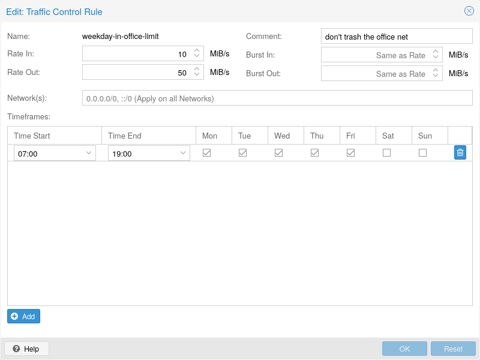

.. _sysadmin_traffic_control:

Traffic Control
---------------

Creating and restoring backups can produce a lot of traffic, can impact shared
storage and other users on the network.

With Proxmox Backup Server, you can constrain network traffic for clients within
specified networks using a token bucket filter (TBF).

This allows you to avoid network congestion and prioritize traffic from
certain hosts.

You can manage the traffic controls either via the web-interface or using the
``traffic-control`` commands of the ``proxmox-backup-manager`` command-line
tool.

.. note:: Sync jobs on the server are not affected by the configured rate-in limits.
   If you want to limit the incoming traffic that a pull-based sync job
   generates, you need to setup a job-specific rate-in limit. See
   :ref:`syncjobs`.

The following command adds a traffic control rule to limit all IPv4 clients
(network ``0.0.0.0/0``) to 100 MB/s:

.. code-block:: console

 # proxmox-backup-manager traffic-control create rule0  --network 0.0.0.0/0 \
   --rate-in 100MB --rate-out 100MB \
   --comment "Default rate limit (100MB/s) for all clients"

.. note:: To limit both IPv4 and IPv6 network spaces, you need to pass two
   network parameters ``::/0`` and ``0.0.0.0/0``.

It is possible to restrict rules to certain time frames, for example the
company's office hours:

.. tip:: You can use SI (base 10: KB, MB, ...) or IEC (base 2: KiB, MiB, ...)
   units.

.. code-block:: console

 # proxmox-backup-manager traffic-control update rule0  \
   --timeframe "mon..fri 8-12" \
   --timeframe "mon..fri 14:30-18"

If there are multiple rules, the server chooses the one with the smaller
network. For example, we can overwrite the setting for our private network (and
the server itself) with:

.. code-block:: console

 # proxmox-backup-manager traffic-control create rule1 \
   --network 192.168.2.0/24 \
   --network 127.0.0.0/8 \
   --rate-in 20GB --rate-out 20GB \
   --comment "Use 20GB/s for the local network"

.. note:: The behavior is undefined if there are several rules for the same network.

If there are multiple rules which match a specific network, they will all be
applied, which means that the smallest one wins, as it's bucket fills up the
fastest.

To list the current rules, use:

.. code-block:: console

 # proxmox-backup-manager traffic-control list
 ┌───────┬─────────────┬─────────────┬─────────────────────────┬────────────...─┐
 │ name  │     rate-in │    rate-out │ network                 │ timeframe  ... │
 ╞═══════╪═════════════╪═════════════╪═════════════════════════╪════════════...═╡
 │ rule0 │      100 MB │      100 MB │ ["0.0.0.0/0"]           │ ["mon..fri ... │
 ├───────┼─────────────┼─────────────┼─────────────────────────┼────────────...─┤
 │ rule1 │       20 GB │       20 GB │ ["192.168.2.0/24", ...] │            ... │
 └───────┴─────────────┴─────────────┴─────────────────────────┴────────────...─┘

Rules can also be removed:

.. code-block:: console

 # proxmox-backup-manager traffic-control remove rule1

To show the state (current data rate) of all configured rules use:

.. code-block:: console

  # proxmox-backup-manager traffic-control traffic
  ┌───────┬─────────────┬──────────────┐
  │ name  │ cur-rate-in │ cur-rate-out │
  ╞═══════╪═════════════╪══════════════╡
  │ rule0 │         0 B │          0 B │
  ├───────┼─────────────┼──────────────┤
  │ rule1 │   1.161 GiB │   19.146 KiB │
  └───────┴─────────────┴──────────────┘
