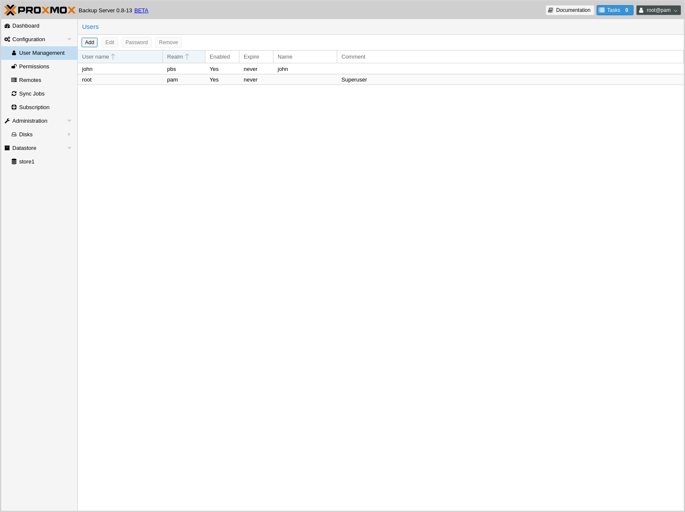
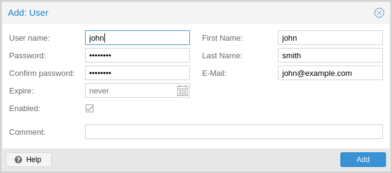
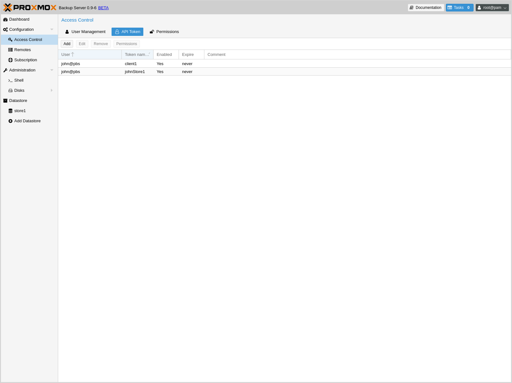
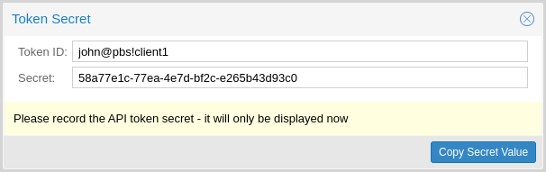
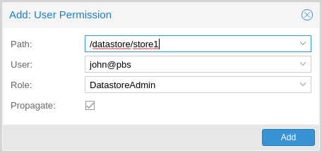
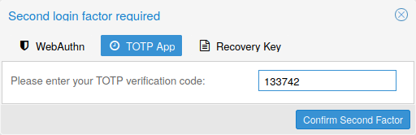
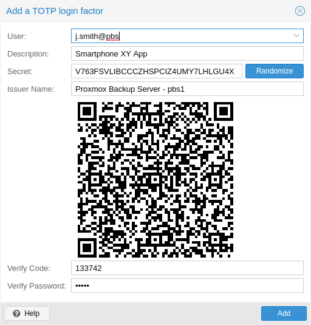
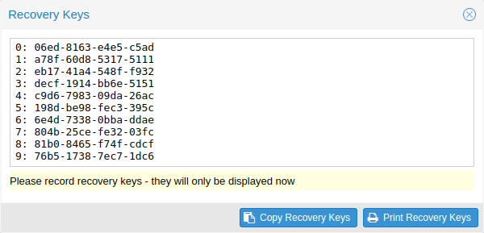

.. _user_mgmt:

User Management
===============

User Configuration
------------------

`Proxmox Backup`_ Server supports several authentication realms, and you need to
choose the realm when you add a new user. Possible realms are:

:pam: Linux PAM standard authentication. Use this if you want to
      authenticate as a Linux system user (users need to exist on the
      system).

:pbs: Proxmox Backup Server realm. This type stores hashed passwords in
      ``/etc/proxmox-backup/shadow.json``.

:openid: OpenID Connect server. Users can authenticate against an external
         OpenID Connect server.

:ldap: LDAP server. Users can authenticate against external LDAP servers.

After installation, there is a single user, ``root@pam``, which corresponds to
the Unix superuser. User configuration information is stored in the file
``/etc/proxmox-backup/user.cfg``. You can use the ``proxmox-backup-manager``
command-line tool to list or manipulate users:

.. code-block:: console

  # proxmox-backup-manager user list
  ┌─────────────┬────────┬────────┬───────────┬──────────┬────────────────┬────────────────────┐
  │ userid      │ enable │ expire │ firstname │ lastname │ email          │ comment            │
  ╞═════════════╪════════╪════════╪═══════════╪══════════╪════════════════╪════════════════════╡
  │ root@pam    │      1 │        │           │          │                │ Superuser          │
  └─────────────┴────────┴────────┴───────────┴──────────┴────────────────┴────────────────────┘

The superuser has full administration rights on everything, so it's recommended
to add other users with less privileges. You can add a new
user with the ``user create`` subcommand or through the web
interface, under the **User Management** tab of **Configuration -> Access
Control**. The ``create`` subcommand lets you specify many options like
``--email`` or ``--password``. You can update or change any user properties
using the ``user update`` subcommand later (**Edit** in the GUI):

.. code-block:: console

  # proxmox-backup-manager user create john@pbs --email john@example.com
  # proxmox-backup-manager user update john@pbs --firstname John --lastname Smith
  # proxmox-backup-manager user update john@pbs --comment "An example user."

.. todo:: Mention how to set password without passing plaintext password as cli argument.

The resulting user list looks like this:

.. code-block:: console

  # proxmox-backup-manager user list
  ┌──────────┬────────┬────────┬───────────┬──────────┬──────────────────┬──────────────────┐
  │ userid   │ enable │ expire │ firstname │ lastname │ email            │ comment          │
  ╞══════════╪════════╪════════╪═══════════╪══════════╪══════════════════╪══════════════════╡
  │ john@pbs │      1 │        │ John      │ Smith    │ john@example.com │ An example user. │
  ├──────────┼────────┼────────┼───────────┼──────────┼──────────────────┼──────────────────┤
  │ root@pam │      1 │        │           │          │                  │ Superuser        │
  └──────────┴────────┴────────┴───────────┴──────────┴──────────────────┴──────────────────┘

Newly created users do not have any permissions. Please read the :ref:`user_acl`
section to learn how to set access permissions.

You can disable a user account by setting ``--enable`` to ``0``:

.. code-block:: console

  # proxmox-backup-manager user update john@pbs --enable 0

Or completely remove a user with:

.. code-block:: console

  # proxmox-backup-manager user remove john@pbs

.. _user_tokens:

API Tokens
----------

Any authenticated user can generate API tokens, which can in turn be used to
configure various clients, instead of directly providing the username and
password.

API tokens serve two purposes:

#. Easy revocation in case client gets compromised
#. Limit permissions for each client/token within the users' permission

An API token consists of two parts: an identifier consisting of the user name,
the realm and a tokenname (``user@realm!tokenname``), and a secret value. Both
need to be provided to the client in place of the user ID (``user@realm``) and
the user password, respectively.

The API token is passed from the client to the server by setting the
``Authorization`` HTTP header with method ``PBSAPIToken`` to the value
``TOKENID:TOKENSECRET``.

You can generate tokens from the GUI or by using ``proxmox-backup-manager``:

.. code-block:: console

  # proxmox-backup-manager user generate-token john@pbs client1
  Result: {
    "tokenid": "john@pbs!client1",
    "value": "d63e505a-e3ec-449a-9bc7-1da610d4ccde"
  }

.. note:: The displayed secret value needs to be saved, since it cannot be
  displayed again after generating the API token.

The ``user list-tokens`` sub-command can be used to display tokens and their
metadata:

.. code-block:: console

  # proxmox-backup-manager user list-tokens john@pbs
  ┌──────────────────┬────────┬────────┬─────────┐
  │ tokenid          │ enable │ expire │ comment │
  ╞══════════════════╪════════╪════════╪═════════╡
  │ john@pbs!client1 │      1 │        │         │
  └──────────────────┴────────┴────────┴─────────┘

Similarly, the ``user delete-token`` subcommand can be used to delete a token
again.

Newly generated API tokens don't have any permissions. Please read the next
section to learn how to set access permissions.

.. _user_acl:

Access Control
--------------

By default, new users and API tokens do not have any permissions. Instead you
need to specify what is allowed and what is not.

Proxmox Backup Server uses a role- and path-based permission management system.
An entry in the permissions table allows a user, group or token to take on a
specific role when accessing an 'object' or 'path'. This means that such an
access rule can be represented as a triple of '(path, user, role)', '(path,
group, role)' or '(path, token, role)', with the role containing a set of
allowed actions, and the path representing the target of these actions.

Privileges
~~~~~~~~~~

Privileges are the building blocks of access roles. They are internally
used to enforce the actual permission checks in the API.

We currently support the following privileges:

**Sys.Audit**
  Sys.Audit allows a user to know about the system and its status.

**Sys.Modify**
  Sys.Modify allows a user to modify system-level configuration and apply updates.

**Sys.PowerManagement**
  Sys.Modify allows a user to power-off and reboot the system.

**Datastore.Audit**
  Datastore.Audit allows a user to know about a datastore, including reading the
  configuration entry and listing its contents.

**Datastore.Allocate**
  Datastore.Allocate allows a user to create or delete datastores.

**Datastore.Modify**
  Datastore.Modify allows a user to modify a datastore and its contents, and to
  create or delete namespaces inside a datastore.

**Datastore.Read**
  Datastore.Read allows a user to read arbitrary backup contents, independent of
  the backup group owner.

**Datastore.Verify**
  Allows verifying the backup snapshots in a datastore.

**Datastore.Backup**
  Datastore.Backup allows a user create new backup snapshots and also provides the
  privileges of Datastore.Read and Datastore.Verify, but only if the backup
  group is owned by the user or one of its tokens.

**Datastore.Prune**
  Datastore.Prune allows a user to delete snapshots, but additionally requires
  backup ownership.

**Permissions.Modify**
  Permissions.Modify allows a user to modify ACLs.

  .. note:: A user can always configure privileges for their own API tokens, as
    they will be limited by the users privileges anyway.

**Remote.Audit**
  Remote.Audit allows a user to read the remote and the sync configuration entries.

**Remote.Modify**
  Remote.Modify allows a user to modify the remote configuration.

**Remote.Read**
  Remote.Read allows a user to read data from a configured `Remote`.

**Sys.Console**
  Sys.Console allows a user to access the system's console, note that for all
  but `root@pam` a valid system login is still required.

**Tape.Audit**
  Tape.Audit allows a user to read the configuration and status of tape drives,
  changers and backups.

**Tape.Modify**
  Tape.Modify allows a user to modify the configuration of tape drives, changers
  and backups.

**Tape.Write**
  Tape.Write allows a user to write to a tape media.

**Tape.Read**
  Tape.Read allows a user to read tape backup configuration and contents from a
  tape media.

**Realm.Allocate**
  Realm.Allocate allows a user to view, create, modify and delete authentication
  realms for users.

Access Roles
~~~~~~~~~~~~

An access role combines one or more privileges into something that can be
assigned to a user or API token on an object path.

Currently, there are only built-in roles, meaning you cannot create your
own, custom role.

The following roles exist:

**NoAccess**
  Disable Access - nothing is allowed.

**Admin**
  Can do anything, on the object path assigned.

**Audit**
  Can view the status and configuration of things, but is not allowed to change
  settings.

**DatastoreAdmin**
  Can do anything on *existing* datastores.

**DatastoreAudit**
  Can view datastore metrics, settings and list content. But is not allowed to
  read the actual data.

**DatastoreReader**
  Can inspect a datastore's or namespace's content and do restores.

**DatastoreBackup**
  Can backup and restore owned backups.

**DatastorePowerUser**
  Can backup, restore, and prune *owned* backups.

**RemoteAdmin**
  Can do anything on remotes.

**RemoteAudit**
  Can view remote settings.

**RemoteSyncOperator**
  Is allowed to read data from a remote.

**TapeAdmin**
  Can do anything related to tape backup.

**TapeAudit**
  Can view tape-related metrics, configuration and status.

**TapeOperator**
  Can do tape backup and restore, but cannot change any configuration.

**TapeReader**
  Can read and inspect tape configuration and media content.

Objects and Paths
~~~~~~~~~~~~~~~~~

Access permissions are assigned to objects, such as a datastore, namespace or
some system resources.

We use filesystem-like paths to address these objects. These paths form a
natural tree, and permissions of higher levels (shorter paths) can optionally
be propagated down within this hierarchy.

Paths can be templated, meaning they can refer to the actual id of a
configuration entry. When an API call requires permissions on a templated
path, the path may contain references to parameters of the API call. These
references are specified in curly brackets.

Some examples are:

.. table::
  :align: left

  =========================== =========================================================
  ``/datastore``              Access to *all* datastores on a Proxmox Backup server
  ``/datastore/{store}``      Access to a specific datastore on a Proxmox Backup server
  ``/datastore/{store}/{ns}`` Access to a specific namespace on a specific datastore
  ``/remote``                 Access to all remote entries
  ``/system/network``         Access to configure the host network
  ``/tape/``                  Access to tape devices, pools and jobs
  ``/access/users``           User administration
  ``/access/openid/{id}``     Administrative access to a specific OpenID Connect realm
  =========================== =========================================================

Inheritance
^^^^^^^^^^^

As mentioned earlier, object paths form a file system like tree, and
permissions can be inherited by objects down that tree through the propagate
flag, which is set by default. We use the following inheritance rules:

* Permissions for API tokens are always limited to those of the user.
* Permissions on deeper, more specific levels replace those inherited from an
  upper level.

Configuration & Management
~~~~~~~~~~~~~~~~~~~~~~~~~~

Access permission information is stored in ``/etc/proxmox-backup/acl.cfg``. The
file contains 5 fields, separated using a colon (':') as a delimiter. A typical
entry takes the form:

``acl:1:/datastore:john@pbs:DatastoreBackup``

The data represented in each field is as follows:

#. ``acl`` identifier
#. A ``1`` or ``0``, representing whether propagation is enabled or disabled,
   respectively
#. The object on which the permission is set. This can be a specific object
   (single datastore, remote, etc.) or a top level object, which with
   propagation enabled, represents all children of the object also.
#. The user(s)/token(s) for which the permission is set
#. The role being set

You can manage permissions via **Configuration -> Access Control ->
Permissions** in the web interface. Likewise, you can use the ``acl``
subcommand to manage and monitor user permissions from the command line. For
example, the command below will add the user ``john@pbs`` as a
**DatastoreAdmin** for the datastore ``store1``, located at
``/backup/disk1/store1``:

.. code-block:: console

  # proxmox-backup-manager acl update /datastore/store1 DatastoreAdmin --auth-id john@pbs

You can list the ACLs of each user/token using the following command:

.. code-block:: console

   # proxmox-backup-manager acl list
   ┌──────────┬───────────────────┬───────────┬────────────────┐
   │ ugid     │ path              │ propagate │ roleid         │
   ╞══════════╪═══════════════════╪═══════════╪════════════════╡
   │ john@pbs │ /datastore/store1 │         1 │ DatastoreAdmin │
   └──────────┴───────────────────┴───────────┴────────────────┘

A single user/token can be assigned multiple permission sets for different
datastores.

.. Note::
  Naming convention is important here. For datastores on the host,
  you must use the convention ``/datastore/{storename}``. For example, to set
  permissions for a datastore mounted at ``/mnt/backup/disk4/store2``, you would use
  ``/datastore/store2`` for the path. For remote stores, use the convention
  ``/remote/{remote}/{storename}``, where ``{remote}`` signifies the name of the
  remote (see `Remote` below) and ``{storename}`` is the name of the datastore on
  the remote.

API Token Permissions
~~~~~~~~~~~~~~~~~~~~~

API token permissions are calculated based on ACLs containing their ID,
independently of those of their corresponding user. The resulting permission set
on a given path is then intersected with that of the corresponding user.

In practice this means:

#. API tokens require their own ACL entries
#. API tokens can never do more than their corresponding user

Effective Permissions
~~~~~~~~~~~~~~~~~~~~~

To calculate and display the effective permission set of a user or API token,
you can use the ``proxmox-backup-manager user permission`` command:

.. code-block:: console

  # proxmox-backup-manager user permissions john@pbs --path /datastore/store1
  Privileges with (*) have the propagate flag set

  Path: /datastore/store1
  - Datastore.Audit (*)
  - Datastore.Backup (*)
  - Datastore.Modify (*)
  - Datastore.Prune (*)
  - Datastore.Read (*)
  - Datastore.Verify (*)

  # proxmox-backup-manager acl update /datastore/store1 DatastoreBackup --auth-id 'john@pbs!client1'
  # proxmox-backup-manager user permissions 'john@pbs!client1' --path /datastore/store1
  Privileges with (*) have the propagate flag set

  Path: /datastore/store1
  - Datastore.Backup (*)

.. _user_tfa:

Two-Factor Authentication
-------------------------

Introduction
~~~~~~~~~~~~

With simple authentication, only a password (single factor) is required to
successfully claim an identity (authenticate), for example, to be able to log in
as `root@pam` on a specific instance of Proxmox Backup Server. In this case, if
the password gets leaked or stolen, anybody can use it to log in - even if they
should not be allowed to do so.

With two-factor authentication (TFA), a user is asked for an additional factor
to verify their authenticity. Rather than relying on something only the user
knows (a password), this extra factor requires something only the user has, for
example, a piece of hardware (security key) or a secret saved on the user's
smartphone. This prevents a remote user from gaining unauthorized access to an
account, as even if they have the password, they will not have access to the
physical object (second factor).

Available Second Factors
~~~~~~~~~~~~~~~~~~~~~~~~

You can set up multiple second factors, in order to avoid a situation in which
losing your smartphone or security key locks you out of your account
permanently.

Proxmox Backup Server supports three different two-factor authentication
methods:

* TOTP (`Time-based One-Time Password <https://en.wikipedia.org/wiki/Time-based_One-Time_Password>`_).
  A short code derived from a shared secret and the current time, it changes
  every 30 seconds.

* WebAuthn (`Web Authentication <https://en.wikipedia.org/wiki/WebAuthn>`_).
  A general standard for authentication. It is implemented by various security
  devices, like hardware keys or trusted platform modules (TPM) from a computer
  or smart phone.

* Single use Recovery Keys. A list of keys which should either be printed out
  and locked in a secure place or saved digitally in an electronic vault.
  Each key can be used only once. These are perfect for ensuring that you are
  not locked out, even if all of your other second factors are lost or corrupt.

Setup
~~~~~

.. _user_tfa_setup_totp:

TOTP
^^^^

There is no server setup required. Simply install a TOTP app on your
smartphone (for example, `FreeOTP <https://freeotp.github.io/>`_) and use the
Proxmox Backup Server web-interface to add a TOTP factor.

.. _user_tfa_setup_webauthn:

WebAuthn
^^^^^^^^

For WebAuthn to work, you need to have two things:

* A trusted HTTPS certificate (for example, by using `Let's Encrypt
  <https://pbs.proxmox.com/wiki/index.php/HTTPS_Certificate_Configuration>`_).
  While it probably works with an untrusted certificate, some browsers may warn
  or refuse WebAuthn operations if it is not trusted.

* Setup the WebAuthn configuration (see **Configuration -> Other** in
  the Proxmox Backup Server web interface). This can be auto-filled in most
  setups.

Once you have fulfilled both of these requirements, you can add a WebAuthn
configuration in the **Two Factor Authentication** tab of the **Access Control**
panel.

.. _user_tfa_setup_recovery_keys:

Recovery Keys
^^^^^^^^^^^^^

Recovery key codes do not need any preparation; you can simply create a set of
recovery keys in the **Two Factor Authentication** tab of the **Access Control**
panel.

.. note:: There can only be one set of single-use recovery keys per user at any
 time.

TFA and Automated Access
~~~~~~~~~~~~~~~~~~~~~~~~

Two-factor authentication is only implemented for the web-interface. You should
use :ref:`API Tokens <user_tokens>` for all other use cases, especially
non-interactive ones (for example, adding a Proxmox Backup Server to Proxmox VE
as a storage).

.. _user_tfa_lockout:

Limits and Lockout of Two-Factor Authentication
~~~~~~~~~~~~~~~~~~~~~~~~~~~~~~~~~~~~~~~~~~~~~~~

A second factor is meant to protect users if their password is somehow leaked
or guessed. However, some factors could still be broken by brute force. For
this reason, users will be locked out after too many failed 2nd factor login
attempts.

For TOTP, 8 failed attempts will disable the user's TOTP factors. They are
unlocked when logging in with a recovery key. If TOTP was the only available
factor, admin intervention is required, and it is highly recommended to require
the user to change their password immediately.

Since FIDO2/Webauthn and recovery keys are less susceptible to brute force
attacks, the limit there is higher (100 tries), but all second factors are
blocked for an hour when exceeded.

An admin can unlock a user's Two-Factor Authentication at any time via the user
list view in the web UI, or using the command line:

.. code-block:: console

  proxmox-backup-manager user tfa unlock joe@pbs

Authentication Realms
---------------------

.. _user_realms_ldap:

LDAP
~~~~

Proxmox Backup Server can utilize external LDAP servers for user authentication.
To achieve this, a realm of the type ``ldap`` has to be configured.

In LDAP, users are uniquely identified by their domain (``dn``). For instance,
in the following LDIF dataset, the user ``user1`` has the unique domain
``uid=user1,ou=People,dc=ldap-test,dc=com``:

.. code-block:: console

  # user1 of People at ldap-test.com
  dn: uid=user1,ou=People,dc=ldap-test,dc=com
  objectClass: top
  objectClass: person
  objectClass: organizationalPerson
  objectClass: inetOrgPerson
  uid: user1
  cn: Test User 1
  sn: Testers
  description: This is the first test user.

In in similar manner, Proxmox Backup Server uses user identifiers (``userid``)
to uniquely identify users. Thus, it is necessary to establish a mapping
between a Proxmox Backup Server ``userid`` and an LDAP ``dn``. This mapping is
established by the ``user-attr`` configuration parameter - it contains the name
of the LDAP attribute containing a valid Proxmox Backup Server user identifier.

For the example above, setting ``user-attr`` to ``uid`` will have the effect
that the user ``user1@<realm-name>`` will be mapped to the LDAP entity
``uid=user1,ou=People,dc=ldap-test,dc=com``. On user login, Proxmox Backup
Server will perform a `subtree search` under the configured Base Domain
(``base-dn``) to query the user's ``dn``. Once the ``dn`` is known, an LDAP
bind operation is performed to authenticate the user against the LDAP server.

As not all LDAP servers allow `anonymous` search operations, it is possible to
configure a bind domain (``bind-dn``) and a bind password (``password``).
If set, Proxmox Backup Server will bind to the LDAP server using these
credentials before performing any search operations.

A full list of all configuration parameters can be found at :ref:`domains.cfg`.

.. note:: In order to allow a particular user to authenticate using the LDAP
  server, you must also add them as a user of that realm in Proxmox Backup
  Server. This can be carried out automatically with syncing.

User Synchronization in LDAP realms
^^^^^^^^^^^^^^^^^^^^^^^^^^^^^^^^^^^

It is possible to automatically sync users for LDAP-based realms, rather than
having to add them to Proxmox VE manually. Synchronization options can be set
in the LDAP realm configuration dialog window in the GUI and via the
``proxmox-backup-manager ldap create/update`` command.
User synchronization can started in the GUI at
Configuration > Access Control > Realms by selecting a realm and pressing the
`Sync` button. In the sync dialog, some of the default options set in the realm
configuration can be overridden. Alternatively, user synchronization can also
be started via the ``proxmox-backup-manager ldap sync`` command.
